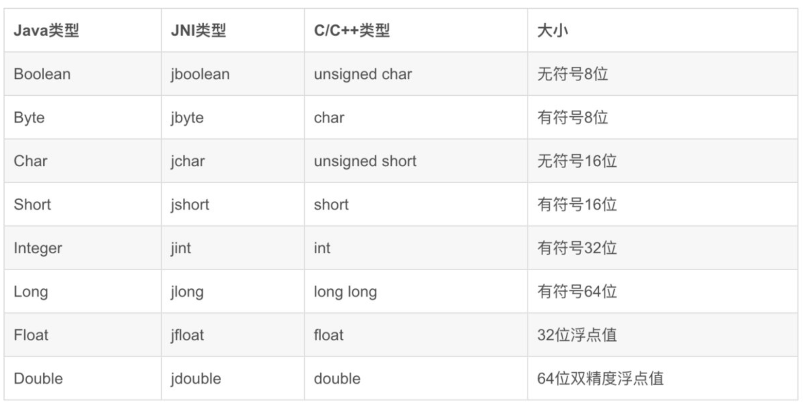

# 学习笔记
# Java

## day1

### Lambda表达式
一个接口中有且仅有一个待实现的抽象方法，那么可以将匿名内部类写成Lambda表达式
```java
Study.java
public interface Study{
 public abstract void study();
}

Main.java
public Main{
 public static void main(String args[]){
 Study study = () -> System.out.println("Studying");
 study.study();
}
}
```

### 转型安全
向上转型安全
向下转型不安全

### 断言 异常 finally

### 泛型类与泛型方法
```java
//泛型类
public class Score<T>{}


//泛型方法
public static void main(String[] args) {
 String[] strings = new String[1];
 Main main = new Main(); //Main类自引用
 main.add(strings, "Hello");
 System.out.println(Arrays.toString(strings));
}

private <T> void add(T[] arr, T t){
arr[0] = t;
} 
```

## day2 
### 泛型方法深入 Lambda深入
```java
//匿名类实现 自定义排序
Integer[] arr = {1, 4, 5, 2, 6, 3, 0, 7, 9, 8};
Arrays.sort(arr, new Comparator<Integer>() {   
//通过创建泛型接口的匿名内部类，来自定义排序规则，因为匿名内部类就是接口的实现类，所以说这里就明确了类型
@Override
public int compare(Integer o1, Integer o2) {   //这个方法会在执行排序时被调用（别人来调用我们的实现）
return o2-o1;
}
});

//Lambda表达式实现 自定义排序
public static void main(String[] args) {
Integer[] arr = {1, 4, 5, 2, 6, 3, 0, 7, 9, 8};
Arrays.sort(arr, (o1, o2) -> o2 - o1);   //瞬间变一行，效果跟上面是一样的
System.out.println(Arrays.toString(arr));
}
```

### 类型擦除
在Java中，类型擦除（Type Erasure）是泛型实现的一部分，这意味着在运行时，所有的泛型信息都会被擦除，转换为它们的边界（通常是 Object），或者如果指定了具体的类型参数，则转换为那个具体类型。
这种机制允许Java在编译时进行泛型类型的检查，同时保持向后兼容，因为Java的早期版本并不支持泛型。 
由于类型擦除的存在，运行时的Java虚拟机（JVM）并不知道泛型参数的具体类型，它只知道原始类型（通常是 Object）。因此，在使用泛型时，不允许进行类型判断，因为编译器在编译时已经移除了泛型的具体类型信息。

### 函数式接口
内置4大函数式接口 
Supplier型 较简单
Consumer型 
```java
public static void main(String[] args) {
     List<String> list = new ArrayList<>();
     list.add("1");
     list.add("2");
     list.add("3");

     list.forEach((s)->{ //forEach的参数实际上就是一个Consumer函数式接口
         System.out.println(s);
     });

 }
```
Function型 
Predicate型

### 文件流
InputStream  字节输入流
OutputStream 字节输出流
Reader  字符输入流
Writer  字符输出流

#### 流的使用

```java
    Long maxId = users.stream().map(user -> user.getId()).reduce((id1, id2) -> id1 > id2 ? id1 : id2).get();

```

这段代码可以返回users中的最大ID


## day3
### 线程
1. Thread在定义是用匿名内部类或者lambda表达式定义线程要实现的内容：Runnable接口
2. start()和run()不同：start开始一个新线程，run则是run是直接在当前线程执行，并不是创建一个线程执行！
3. 每一个Thread对象中，都有一个interrupt()方法，调用此方法后， 会给指定线程添加一个中断标记以告知线程需要立即停止运行或是进行其他操作，由线程来响应此中断并进行相应的处理。
4. 一般用interrupt()终止对象，而非stop()
5. Thread.sleep()是当前线程休眠
6. ```java
   if(Thread.currentThread().isInterrupted()){   //判断是否存在中断标志
   System.out.println("发现中断信号，复位，继续运行...");
   Thread.interrupted();  //复位中断标记（返回值是当前是否有中断标记，这里不用管）
   }
   ```
7. yield()方法来将当前资源让位给其他同优先级线程 Thread.yield();
8. 使用join()方法来实现线程的加入,即调用者等待被调用者线程完成其所有操作，自身变为暂停操作
9. synchronized代码块，它需要在括号中填入一个内容，必须是一个对象或是一个类 可以创建Object o1 = new Object();
   ```java
   Thread t1 = new Thread(() -> {
      for (int i = 0; i < 10000; i++) {
         synchronized (Main.class){  //使用synchronized关键字创建同步代码块
            value++;
         }
      }
      System.out.println("线程1完成");
   });
   ```
   synchronized是悲观锁 传入对象或类的锁，对同一变量进行修改的需要时同一把锁
   synchronized关键字也可以作用于方法上，调用此方法时也会获取锁
   ```java
   private static synchronized void add(){
   value++;
   }
   ```
10. suspend()在使线程暂停的同时，并不会去释放任何锁资源,因此不推荐用
11. 注意是资源wait o1.wait()方法会暂时使得此线程进入等待状态，同时会释放当前代码块持有的锁，
    这时其他线程可以获取到此对象的锁，当其他线程调用对象的notify()方法后，
    会唤醒刚才变成等待状态的线程（这时并没有立即释放锁）。注意，必须是在持有锁（同步代码块内部）的情况下使用，否则会抛出异常！
    notifyAll其实和notify一样，也是用于唤醒，但是前者是唤醒所有调用wait()后处于等待的线程，而后者是看运气随机选择一个。
12. ThreadLocal<T>创建一个供线程用的变量，将变量值存储在里面set(),get()
      不同的线程访问ThreadLocal对象只能获取到对应自己的对象，同时set也不会干扰其它线程，
13. 但是ThreadLocal同样隔离了父子线程，而父子线程应该能够共享内存区
      因此用ThreadLocal<T> = new InheritableThreadLocal<>()，这样父线程会自动传递给子线程
### 定时任务 循环任务
```java
   public static void main(String[] args) {
       Timer timer = new Timer();    //创建定时器对象
       timer.schedule(new TimerTask() {   //注意这个是一个抽象类，不是接口，无法使用lambda表达式简化，只能使用匿名内部类
           @Override
           public void run() {
               System.out.println(Thread.currentThread().getName());    //打印当前线程名称
           }
       }, 1000,1000);    //第二个参数是延迟时间，第三个参数是循环延迟时间
        //timer.cancel();
    }
```
上面代码执行结束后，仍不会停止java程序,必须有cancel，才会关闭定时器定时器，从而退出程序
### 守护线程
当一个线程设置为守护线程时，t.setDaemon(true),当所有非守护线程结束时，他也会自动结束
### 生产者消费者代码
```java
import java.io.BufferedInputStream;
import java.io.FileInputStream;
import java.io.IOException;
import java.util.LinkedList;
import java.util.Queue;

public class Main{
    static Queue<Object> queue = new LinkedList<>();
    public static void main(String[] args) throws InterruptedException {
        new Thread(Main::add,"生产者1").start();
        new Thread(Main::add,"生产者2").start();
        new Thread(Main::take,"消费者1").start();
        new Thread(Main::take,"消费者2").start();
    }

    private static void add(){
        while (true){
            synchronized (queue){
                try {
                    Thread.sleep(300);
                    System.out.println(Thread.currentThread().getName()+"出餐了");
                    queue.offer(new Object());
                    queue.notifyAll();
                } catch (InterruptedException e) {
                    throw new RuntimeException(e);
                }
            }
        }
    }

    private static void take(){
        while (true){
            try{
                synchronized (queue){
                    while (queue.isEmpty()) queue.wait();
                    queue.poll();
                    System.out.println(Thread.currentThread().getName()+"吃饭了");
                    Thread.sleep(400);

                }
            } catch (InterruptedException e) {
                throw new RuntimeException(e);
            }
        }
    }

}
```
### 反射
1. 类加载后会提取类的信息生成一个Class对象放在内存中，反射则利用该Class对象来获取类信息和操作
2. 可通过类名.class关键字或者Class.forName("包名.类名")或者通过实例对象获取对象.getClass()
   注意Class类也是**泛型**类<> 可以使用通配符?
   ```java
      Class<String> stringClass = String.class;
      Class<?> stringClass = Class.forName("java.lang.String");
      Class<String> stringClass = new String("str").getClass();
   ```
3. JVM中每个类始终只存在**一个**Class对象
4. 基本类型没法不是类，但是可以获得int.class，结果是：
   int.class == Integer.TYPE == int
   Integer.class == java.lang.Integer 包装类型的Class对象并不是基本类型Class对象
5. 数组类也可以：Class<String[]> clazz = String[].class; 从而得到一些信息
   注意数组类的类名开头都是[
6. instanceof判断一个对象是否为此接口或是类的实现或是子类
7. getInterfaces() 获得接口们：
   ```java
   Class<?>[] clazz = ArrayList.class.getInterfaces();
   ```
8. ~~感觉暂时不重要 可跳过~~Type类型 一般有泛型时可以用
   ```java
   ParameterizedType type = (ParameterizedType) ArrayList.class.getGenericSuperClass();
   ```
   获取父类的参数化类型
   获取实际类型：
   ```java
   Typep[] types = type.getActualTypeArguments
   ```
### 反射操作
1. 在JDK9之后，不再推荐使用newInstance()方法了 创建对象：clazz.newInstance() 但是只用于默认无参数构造函数 
2. 使用获取构造函数，传入参数的类名
   ```java
   Class<Student> clazz = Student.class;
   Student student = clazz.getConstructor(String.class).newInstance("123");
   ```
4. 如果构造函数是private，无法外部访问：利用反射修改访问权限：
   ```java
   Class<Student> clazz = Student.class;
   Constructor<Student> constructor = clazz.getDeclaredConstructor(String.class);
   constructor.setAccessible(true);   //修改访问权限
   Student student = constructor.newInstance("what's up");
   ```
5. Method对象可以实例化为clazz.getMethod():
   ```java
   public static void main(String[] args) throws ReflectiveOperationException {
    Class<?> clazz = Class.forName("com.test.Student");
    Object instance = clazz.newInstance();   //创建出学生对象
    Method method = clazz.getMethod("test", String.class);   //通过方法名和形参类型获取类中的方法
    method.invoke(instance, "what's up");   //通过Method对象的invoke方法来调用方法
   }
   ```
   Method和Constructor都和Class一样，他们存储了方法的信息，包括方法的形式参数列表，返回值，方法的名称等内容，我们可以直接通过Method对象来获取这些信息
6. Field可以获取变量成员，之后可以直接设置新值
   ```java
   Field field = clazz.getDeclaredField("i");   //获取类的成员字段i
   field.setAccessible(true);
   field.set(instance, 100);   //将类实例instance的成员字段i设置为100
   ```

## day4
### stream读取bytes
   先定义流并打开文件，之后定义byte数组，并将大小设置为文件大小（其实就是流的可用大小），之后流读取到数组
   ```java
    FileInputStream stream = new FileInputStream("Test.class");
    byte[] bytes = new byte[stream.available()];
    stream.read(bytes);
   ```
### 注解
1. 自定义注解:要实现Target（标注到哪里）和Retention（保存在class文件还是运行时可以通过反射访问）
   自定义注解Test：
   ```java
   @Target(ElementType.METHOD)
   @Retention(RetentionPolicy.RUNTIME)
   public @interface Test {
   
   }
   ```
2. 注解的属性也叫做成员变量，注解只有成员变量，没有方法
   其方法名定义了该成员变量的名字，其返回值定义了该成员变量的类型
   ```java
   @Target({ElementType.METHOD, ElementType.TYPE})
   @Retention(RetentionPolicy.RUNTIME)
   public @interface Test {
    String value();
   }
   ```
   可以默认叫value 可以@Test("value值")
   如果不叫value  则需要@Test(test="test值")
   可以在定义后加入 dafault：
   String value() default "default值";
3. 反射访问注解
   类的注解
   Annotation annotation : clazz.getAnnotations()
   方法的注解
   Annotation annotation : clazz.getMethod("test").getAnnotations()

## day5
### Swing类
1. 当很多东西都需要有一个逻辑的时候，如每个窗口都需要居中显示等逻辑，可以设计顶层抽象类
   这样，以后都选择继承这个类即可。如：
   ```java
   public abstract class AbstractWindow extends JFrame{}
      protected AbstractWindow(String title,Dimension defaultSize,boolean resizable){
        //在构造方法中直接默认同意逻辑
       }
   
   ```
2. 添加组件可以由抽象类提供统一方法，addComponent
   ```java
   /* 集组件配置、添加组件到容器、添加到组件表一步到位。
     * @param name 组件的名称
     * @param component 待添加的组件
     * @param constraints 组件约束
     * @param consumer 组件配置在这里写
    调用：
     *     this.addComponent("welcome.button.test", new JButton(), button -> {
     *          button.setLabel("我是按钮");
     *          button.setSize(100, 200);
     *          button.setLocation(200, 200);
     *     });
     */
    protected final <T extends Component> void addComponent(String name, T component, Object constraints, Consumer<T> consumer){
        if(consumer != null)
            consumer.accept(component);
        this.componentMap.put(name, component); //丢入Map中 以后直接查Map找
        this.add(component, constraints);
    }
   ```
   
### JVM
1. JVM运行字节码时，所有的操作基本都是围绕两种数据结构，一种是堆栈（本质是栈结构），还有一种是队列，如果JVM执行某条指令时，该指令需要对数据进行操作，那么被操作的数据在指令执行前，必须要压到堆栈上，JVM会自动将栈顶数据作为操作数。如果堆栈上的数据需要暂时保存起来时，那么它就会被存储到局部变量队列上
2. 大部分指令都是没有操作数,Java相比C编译出来的汇编指令，执行起来会更加复杂，实现某个功能的指令条数也会更多，所以Java的执行效率实际上是不如C/C++的，虽然能够很方便地实现跨平台，但是性能上大打折扣，所以在性能要求比较苛刻的Android上，采用的是定制版的JVM，并且是基于寄存器的指令集架构

### JNI
JAVA调用本地方法，它允许在Java虚拟机内运行的Java代码与其他编程语言（如C/C++和汇编语言）编写的程序和库进行交互
现在我们想用C语言实现一个加法，在java中调用：
   ```java
      public class Main {
      public static void main(String[] args) {
         System.out.println(sum(1, 2));
      }
   
      //本地方法使用native关键字标记，无需任何实现，交给C语言实现
      public static native int sum(int a, int b);
       }
   ```
构建生成.class文件，然后我们让其自动生成对应C头文件(包含待实现的C函数声明)
```shell
   javah -classpath out/production/SimpleHelloWorld -d ./jni com.test.Main
```
生成的.h头文件：
   ```c
      /* DO NOT EDIT THIS FILE - it is machine generated */
      #include <jni.h>
      /* Header for class com_test_Main */
      
      #ifndef _Included_com_test_Main
      #define _Included_com_test_Main
      #ifdef __cplusplus
      extern "C" {
      #endif
      /*
       * Class:     com_test_Main
       * Method:    sum
       * Signature: (II)V
       */
      JNIEXPORT void JNICALL Java_com_test_Main_sum
        (JNIEnv *, jclass, jint, jint);
      
      #ifdef __cplusplus
      }
      #endif
      #endif
   ```
接着我们在CLion中新建一个C++项目，并引入刚刚生成的头文件，并导入jni相关头文件（在JDK文件夹中）：
   ```cmake
      cmake_minimum_required(VERSION 3.21)
      project(JNITest)
   
      include_directories(/Library/Java/JavaVirtualMachines/zulu-8.jdk/Contents/Home/include)
      include_directories(/Library/Java/JavaVirtualMachines/zulu-8.jdk/Contents/Home/include/darwin)
      set(CMAKE_CXX_STANDARD 14)
      
      add_executable(JNITest com_test_Main.cpp com_test_Main.h)
   ```
编写c函数体

   ```c
      #include "com_test_Main.h"
      
      JNIEXPORT jint JNICALL Java_com_test_Main_sum
              (JNIEnv * env, jclass clazz, jint a, jint b){
          return a + b;
      }
   ```
接着我们就可以使用gcc将cpp编译为动态链接库,并放到某一位置，之后在java代码中加载链接库：
   ```java
      public class Main {
      static {
         System.load("Desktop/test.dll");
      }
   
      public static void main(String[] args) {
         System.out.println(sum(1, 2));
      }
   
      public static native int sum(int a, int b);
       }
   ```
### 垃圾回收和JVM内存组成 见手写笔记
### class文件组成  见手写笔记
***
