# 学习笔记（主要记录代码）
## day1 
1. ### Lambda表达式
    一个接口中有且仅有一个待实现的抽象方法，那么可以将匿名内部类写成Lambda表达式
   ```java
   Study.java
   public interface Study{
    public abstract void study();
   }
   
   Main.java
   public Main{
    public static void main(String args[]){
    Study study = () -> System.out.println("Studying");
    study.study();
   }
   }
   ```
2. ### 转型安全
   向上转型安全
   向下转型不安全
3. ### 断言 异常 finally
4. ### 泛型类与泛型方法
   ```java
   //泛型类
   public class Score<T>{}
   
   
   //泛型方法
   public static void main(String[] args) {
    String[] strings = new String[1];
    Main main = new Main(); //Main类自引用
    main.add(strings, "Hello");
    System.out.println(Arrays.toString(strings));
   }

   private <T> void add(T[] arr, T t){
   arr[0] = t;
   } 
   ```
## day2 
1. ### 泛型方法深入 Lambda深入
   ```java
   //匿名类实现 自定义排序
   Integer[] arr = {1, 4, 5, 2, 6, 3, 0, 7, 9, 8};
   Arrays.sort(arr, new Comparator<Integer>() {   
   //通过创建泛型接口的匿名内部类，来自定义排序规则，因为匿名内部类就是接口的实现类，所以说这里就明确了类型
   @Override
   public int compare(Integer o1, Integer o2) {   //这个方法会在执行排序时被调用（别人来调用我们的实现）
   return o2-o1;
   }
   });
   
   //Lambda表达式实现 自定义排序
   public static void main(String[] args) {
   Integer[] arr = {1, 4, 5, 2, 6, 3, 0, 7, 9, 8};
   Arrays.sort(arr, (o1, o2) -> o2 - o1);   //瞬间变一行，效果跟上面是一样的
   System.out.println(Arrays.toString(arr));
   }
   ```
2. ### 类型擦除
   在Java中，类型擦除（Type Erasure）是泛型实现的一部分，这意味着在运行时，所有的泛型信息都会被擦除，转换为它们的边界（通常是 Object），或者如果指定了具体的类型参数，则转换为那个具体类型。
   这种机制允许Java在编译时进行泛型类型的检查，同时保持向后兼容，因为Java的早期版本并不支持泛型。 
   由于类型擦除的存在，运行时的Java虚拟机（JVM）并不知道泛型参数的具体类型，它只知道原始类型（通常是 Object）。因此，在使用泛型时，不允许进行类型判断，因为编译器在编译时已经移除了泛型的具体类型信息。
3. ### 函数式接口
   内置4大函数式接口 
   Supplier型 较简单
   Consumer型 
   ```java
   public static void main(String[] args) {
        List<String> list = new ArrayList<>();
        list.add("1");
        list.add("2");
        list.add("3");

        list.forEach((s)->{ //forEach的参数实际上就是一个Consumer函数式接口
            System.out.println(s);
        });

    }
   ```
   Function型 
   Predicate型
4. ### 文件流
   InputStream  字节输入流
   OutputStream 字节输出流
   Reader  字符输入流
   Writer  字符输出流
## day3
### 线程
1. Thread在定义是用匿名内部类或者lambda表达式定义线程要实现的内容：Runnable接口
2. start()和run()不同：start开始一个新线程，run则是run是直接在当前线程执行，并不是创建一个线程执行！
3. 每一个Thread对象中，都有一个interrupt()方法，调用此方法后， 会给指定线程添加一个中断标记以告知线程需要立即停止运行或是进行其他操作，由线程来响应此中断并进行相应的处理。
4. 一般用interrupt()终止对象，而非stop()
5. Thread.sleep()是当前线程休眠
6. ```java
   if(Thread.currentThread().isInterrupted()){   //判断是否存在中断标志
   System.out.println("发现中断信号，复位，继续运行...");
   Thread.interrupted();  //复位中断标记（返回值是当前是否有中断标记，这里不用管）
   }
   ```
7. yield()方法来将当前资源让位给其他同优先级线程 Thread.yield();
8. 使用join()方法来实现线程的加入,即调用者等待被调用者线程完成其所有操作，自身变为暂停操作
9. synchronized代码块，它需要在括号中填入一个内容，必须是一个对象或是一个类 可以创建Object o1 = new Object();
   ```java
   Thread t1 = new Thread(() -> {
      for (int i = 0; i < 10000; i++) {
         synchronized (Main.class){  //使用synchronized关键字创建同步代码块
            value++;
         }
      }
      System.out.println("线程1完成");
   });
   ```
   synchronized是悲观锁 传入对象或类的锁，对同一变量进行修改的需要时同一把锁
   synchronized关键字也可以作用于方法上，调用此方法时也会获取锁
   ```java
   private static synchronized void add(){
   value++;
   }
   ```
10. suspend()在使线程暂停的同时，并不会去释放任何锁资源,因此不推荐用
11. 注意是资源wait o1.wait()方法会暂时使得此线程进入等待状态，同时会释放当前代码块持有的锁，
    这时其他线程可以获取到此对象的锁，当其他线程调用对象的notify()方法后，
    会唤醒刚才变成等待状态的线程（这时并没有立即释放锁）。注意，必须是在持有锁（同步代码块内部）的情况下使用，否则会抛出异常！
    notifyAll其实和notify一样，也是用于唤醒，但是前者是唤醒所有调用wait()后处于等待的线程，而后者是看运气随机选择一个。
12. ThreadLocal<T>创建一个供线程用的变量，将变量值存储在里面set(),get()
   不同的线程访问ThreadLocal对象只能获取到对应自己的对象，同时set也不会干扰其它线程，
13. 但是ThreadLocal同样隔离了父子线程，而父子线程应该能够共享内存区
   因此用ThreadLocal<T> = new InheritableThreadLocal<>()，这样父线程会自动传递给子线程
### 定时任务 循环任务
```java
   public static void main(String[] args) {
       Timer timer = new Timer();    //创建定时器对象
       timer.schedule(new TimerTask() {   //注意这个是一个抽象类，不是接口，无法使用lambda表达式简化，只能使用匿名内部类
           @Override
           public void run() {
               System.out.println(Thread.currentThread().getName());    //打印当前线程名称
           }
       }, 1000,1000);    //第二个参数是延迟时间，第三个参数是循环延迟时间
        //timer.cancel();
    }
```
上面代码执行结束后，仍不会停止java程序,必须有cancel，才会关闭定时器定时器，从而退出程序
### 守护线程
当一个线程设置为守护线程时，t.setDaemon(true),当所有非守护线程结束时，他也会自动结束
### 生产者消费者代码
```java
import java.io.BufferedInputStream;
import java.io.FileInputStream;
import java.io.IOException;
import java.util.LinkedList;
import java.util.Queue;

public class Main{
    static Queue<Object> queue = new LinkedList<>();
    public static void main(String[] args) throws InterruptedException {
        new Thread(Main::add,"生产者1").start();
        new Thread(Main::add,"生产者2").start();
        new Thread(Main::take,"消费者1").start();
        new Thread(Main::take,"消费者2").start();
    }

    private static void add(){
        while (true){
            synchronized (queue){
                try {
                    Thread.sleep(300);
                    System.out.println(Thread.currentThread().getName()+"出餐了");
                    queue.offer(new Object());
                    queue.notifyAll();
                } catch (InterruptedException e) {
                    throw new RuntimeException(e);
                }
            }
        }
    }

    private static void take(){
        while (true){
            try{
                synchronized (queue){
                    while (queue.isEmpty()) queue.wait();
                    queue.poll();
                    System.out.println(Thread.currentThread().getName()+"吃饭了");
                    Thread.sleep(400);

                }
            } catch (InterruptedException e) {
                throw new RuntimeException(e);
            }
        }
    }

}
```
### 反射
1. 类加载后会提取类的信息生成一个Class对象放在内存中，反射则利用该Class对象来获取类信息和操作
2. 可通过类名.class关键字或者Class.forName("包名.类名")或者通过实例对象获取对象.getClass()
   注意Class类也是**泛型**类<> 可以使用通配符?
   ```java
      Class<String> stringClass = String.class;
      Class<?> stringClass = Class.forName("java.lang.String");
      Class<String> stringClass = new String("str").getClass();
   ```
3. JVM中每个类始终只存在**一个**Class对象
4. 基本类型没法不是类，但是可以获得int.class，结果是：
   int.class == Integer.TYPE == int
   Integer.class == java.lang.Integer 包装类型的Class对象并不是基本类型Class对象
5. 数组类也可以：Class<String[]> clazz = String[].class; 从而得到一些信息
   注意数组类的类名开头都是[
6. instanceof判断一个对象是否为此接口或是类的实现或是子类
7. getInterfaces() 获得接口们：
   ```java
   Class<?>[] clazz = ArrayList.class.getInterfaces();
   ```
8. ~~感觉暂时不重要 可跳过~~Type类型 一般有泛型时可以用
   ```java
   ParameterizedType type = (ParameterizedType) ArrayList.class.getGenericSuperClass();
   ```
   获取父类的参数化类型
   获取实际类型：
   ```java
   Typep[] types = type.getActualTypeArguments
   ```
### 反射操作
1. 在JDK9之后，不再推荐使用newInstance()方法了 创建对象：clazz.newInstance() 但是只用于默认无参数构造函数 
2. 使用获取构造函数，传入参数的类名
   ```java
   Class<Student> clazz = Student.class;
   Student student = clazz.getConstructor(String.class).newInstance("123");
   ```
4. 如果构造函数是private，无法外部访问：利用反射修改访问权限：
   ```java
   Class<Student> clazz = Student.class;
   Constructor<Student> constructor = clazz.getDeclaredConstructor(String.class);
   constructor.setAccessible(true);   //修改访问权限
   Student student = constructor.newInstance("what's up");
   ```
5. Method对象可以实例化为clazz.getMethod():
   ```java
   public static void main(String[] args) throws ReflectiveOperationException {
    Class<?> clazz = Class.forName("com.test.Student");
    Object instance = clazz.newInstance();   //创建出学生对象
    Method method = clazz.getMethod("test", String.class);   //通过方法名和形参类型获取类中的方法
    method.invoke(instance, "what's up");   //通过Method对象的invoke方法来调用方法
   }
   ```
   Method和Constructor都和Class一样，他们存储了方法的信息，包括方法的形式参数列表，返回值，方法的名称等内容，我们可以直接通过Method对象来获取这些信息
6. Field可以获取变量成员，之后可以直接设置新值
   ```java
   Field field = clazz.getDeclaredField("i");   //获取类的成员字段i
   field.setAccessible(true);
   field.set(instance, 100);   //将类实例instance的成员字段i设置为100
   ```

## day4
### stream读取bytes:
   先定义流并打开文件，之后定义byte数组，并将大小设置为文件大小（其实就是流的可用大小），之后流读取到数组
   ```java
    FileInputStream stream = new FileInputStream("Test.class");
    byte[] bytes = new byte[stream.available()];
    stream.read(bytes);
   ```
### 注解
1. 自定义注解:要实现Target（标注到哪里）和Retention（保存在class文件还是运行时可以通过反射访问）
   自定义注解Test：
   ```java
   @Target(ElementType.METHOD)
   @Retention(RetentionPolicy.RUNTIME)
   public @interface Test {
   
   }
   ```
2. 注解的属性也叫做成员变量，注解只有成员变量，没有方法
   其方法名定义了该成员变量的名字，其返回值定义了该成员变量的类型
   ```java
   @Target({ElementType.METHOD, ElementType.TYPE})
   @Retention(RetentionPolicy.RUNTIME)
   public @interface Test {
    String value();
   }
   ```
   可以默认叫value 可以@Test("value值")
   如果不叫value  则需要@Test(test="test值")
   可以在定义后加入 dafault：
   String value() default "default值";
3. 反射访问注解
   类的注解
   Annotation annotation : clazz.getAnnotations()
   方法的注解
   Annotation annotation : clazz.getMethod("test").getAnnotations()

## day5
### Swing类
1. 当很多东西都需要有一个逻辑的时候，如每个窗口都需要居中显示等逻辑，可以设计顶层抽象类
   这样，以后都选择继承这个类即可。如：
   ```java
   public abstract class AbstractWindow extends JFrame{}
      protected AbstractWindow(String title,Dimension defaultSize,boolean resizable){
        //在构造方法中直接默认同意逻辑
       }

   ```
2. 添加组件可以由抽象类提供统一方法，addComponent
   ```java
   /* 集组件配置、添加组件到容器、添加到组件表一步到位。
     * @param name 组件的名称
     * @param component 待添加的组件
     * @param constraints 组件约束
     * @param consumer 组件配置在这里写
    调用：
     *     this.addComponent("welcome.button.test", new JButton(), button -> {
     *          button.setLabel("我是按钮");
     *          button.setSize(100, 200);
     *          button.setLocation(200, 200);
     *     });
     */
    protected final <T extends Component> void addComponent(String name, T component, Object constraints, Consumer<T> consumer){
        if(consumer != null)
            consumer.accept(component);
        this.componentMap.put(name, component); //丢入Map中 以后直接查Map找
        this.add(component, constraints);
    }
   ```
   
### JVM
1. JVM运行字节码时，所有的操作基本都是围绕两种数据结构，一种是堆栈（本质是栈结构），还有一种是队列，如果JVM执行某条指令时，该指令需要对数据进行操作，那么被操作的数据在指令执行前，必须要压到堆栈上，JVM会自动将栈顶数据作为操作数。如果堆栈上的数据需要暂时保存起来时，那么它就会被存储到局部变量队列上
2. 大部分指令都是没有操作数,Java相比C编译出来的汇编指令，执行起来会更加复杂，实现某个功能的指令条数也会更多，所以Java的执行效率实际上是不如C/C++的，虽然能够很方便地实现跨平台，但是性能上大打折扣，所以在性能要求比较苛刻的Android上，采用的是定制版的JVM，并且是基于寄存器的指令集架构

### JNI
JAVA调用本地方法，它允许在Java虚拟机内运行的Java代码与其他编程语言（如C/C++和汇编语言）编写的程序和库进行交互
现在我们想用C语言实现一个加法，在java中调用：
   ```java
      public class Main {
      public static void main(String[] args) {
         System.out.println(sum(1, 2));
      }
   
      //本地方法使用native关键字标记，无需任何实现，交给C语言实现
      public static native int sum(int a, int b);
       }
   ```
构建生成.class文件，然后我们让其自动生成对应C头文件(包含待实现的C函数声明)
```shell
   javah -classpath out/production/SimpleHelloWorld -d ./jni com.test.Main
```
生成的.h头文件：
   ```c
      /* DO NOT EDIT THIS FILE - it is machine generated */
      #include <jni.h>
      /* Header for class com_test_Main */
      
      #ifndef _Included_com_test_Main
      #define _Included_com_test_Main
      #ifdef __cplusplus
      extern "C" {
      #endif
      /*
       * Class:     com_test_Main
       * Method:    sum
       * Signature: (II)V
       */
      JNIEXPORT void JNICALL Java_com_test_Main_sum
        (JNIEnv *, jclass, jint, jint);
      
      #ifdef __cplusplus
      }
      #endif
      #endif
   ```
接着我们在CLion中新建一个C++项目，并引入刚刚生成的头文件，并导入jni相关头文件（在JDK文件夹中）：
   ```cmake
      cmake_minimum_required(VERSION 3.21)
      project(JNITest)
   
      include_directories(/Library/Java/JavaVirtualMachines/zulu-8.jdk/Contents/Home/include)
      include_directories(/Library/Java/JavaVirtualMachines/zulu-8.jdk/Contents/Home/include/darwin)
      set(CMAKE_CXX_STANDARD 14)
      
      add_executable(JNITest com_test_Main.cpp com_test_Main.h)
   ```
编写c函数体

   ```c
      #include "com_test_Main.h"
      
      JNIEXPORT jint JNICALL Java_com_test_Main_sum
              (JNIEnv * env, jclass clazz, jint a, jint b){
          return a + b;
      }
   ```
接着我们就可以使用gcc将cpp编译为动态链接库,并放到某一位置，之后在java代码中加载链接库：
   ```java
      public class Main {
      static {
         System.load("Desktop/test.dll");
      }
   
      public static void main(String[] args) {
         System.out.println(sum(1, 2));
      }
   
      public static native int sum(int a, int b);
       }
   ```
### 垃圾回收和JVM内存组成 见手写笔记
### class文件组成  见手写笔记
***
## day0917 Spring
### Maven
1. Maven 其中一个核心特性就是依赖管理。我们开发的项目基本会使用外部依赖，或者我们需要处理多模块项目的模块之间的依赖，这些依赖关系非常复杂，管理起来比较困难。使用 Maven 管理依赖能大大降低难度。
2. Maven 对于依赖管理一个特点是可传递性依赖发现，比如我们项目依赖于 A，A 又依赖于 B，如果我们手动添加的话，需要将 A 和 B 两个依赖都下载引入项目。而使用 Maven 来构建项目的话，我们只需要显示引入依赖 A，Maven 会通过读取项目文件（pom.xml），找出它们项目之间的依赖关系，将 A 和 B 都引入进来
3. Maven 使用坐标管理依赖，坐标包含三个标识信息，通过坐标可以唯一标识一个依赖。
   group：定义当前项目所属组织或公司的唯一标识，一般为组织或者公司名称域名倒写（也可以是域名倒写+项目名），例如 com.alibaba
   artifactId：项目的唯一 ID，一般是实际项目名称或者实际项目的一个模块名称（如果项目比较大，会划分多模块，例如 spring-core，spring-bean），例如 fastjson
   version：项目的版本号，例如 1.2.76
   ```xml
   <dependency>
    <groupId>com.alibaba</groupId>
    <artifactId>fastjson</artifactId>
    <version>1.2.76</version>
   </dependency>
   ```
4. 可以下载到本地 将jar包放入文件夹中 比如/lib，将scope标记为system
   ```xml
   <dependency>
   <groupId>com.alibaba</groupId>  <!-- 可以自定义 -->
   <artifactId>fastjson</artifactId>   <!--可以自定义-->
   <version>1.2.75</version>
   <scope>system</scope>
   <systemPath>${basedir}\libs\fastjson-1.2.75.jar</systemPath>
   </dependency>
   ```
5. 基于 Maven 构建的项目，项目需要的依赖首先会在本地仓库中查找，如果没有找到则会从远程仓库下载到本地仓库。如果这两者都没有找到，Maven 就会报错。
   每个用户在自己电脑上会有个本地仓库，存放所有下载过的依赖包，Windows 环境下，位置一般在用户目录的 .m2/repository 目录下。 

   *`0918困难： 如果手动删除了每个本地仓库的包 那么就执行clean 和 install重新下载`*
6. maven项目目录：
   ${basedir}：根目录，pom.xml 文件以及项目所有的子目录
   ${basedir}/src/main/java：项目的 java 源代码
   ${basedir}/src/main/resources：项目的资源文件，例如 application.yml，xml 文件等
   ${basedir}/src/test/java：存放项目的 java 测试源代码
   ${basedir}/src/test/resources：存放项目测试要用的资源文件
   ${basedir}/target：编译打包输出目录
   ${basedir}/target/classes：编译输出目录
   ${basedir}/target/test-classes：测试编译输出目录
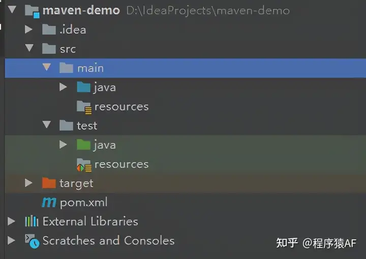
7. Maven 可以添加插件，插件其实就是一些 jar 文件，执行 Maven 命令时，真正完成功能的就是插件
Springboot插件：
   ```xml
   <build>
     <plugins>
       <plugin>
         <groupId>org.springframework.boot</groupId>
         <artifactId>spring-boot-maven-plugin</artifactId>
       </plugin>
     </plugins>
   </build>
   ```
8.  Maven 编译插件，可以设置项目使用的 JDK 版本是通过编译插件指定
   ```xml
   <build>
     <plugins>
       <plugin>
         <groupId>org.apache.maven.plugins</groupId>
         <artifactId>maven-compiler-plugin</artifactId>
         <version>3.8.1</version>
       </plugin>
       <configuration>
         <source>1.8</source>
         <target>1.8</target>
       </configuration>
     </plugins>
   </build>
   ```
9. 当项目较大时，可以使用父子Maven工程：
   基于Maven 构建的项目，一般会定义一个 parent POM 作为一组子 module 的聚合 POM。
   在 parent POM 中使用 <modules> 标签来定义它的一组子模块。虽然在 parent POM 中不会有什么实际构建产出，但是我们可以在 parent POM 中定义一些共同构建配置，依赖等，并且可以被子模块继承
   比如：
   在父模块的基础上创建子模块，直接在父模块项目右键创建子模块 maven-dao，maven-service，maven-controller

   又比如：
   学习spring时候，先创建spring6父工程，之后每一个新项目，都在父工程下面创建子模块
10. 创建Spring项目的一般步骤: 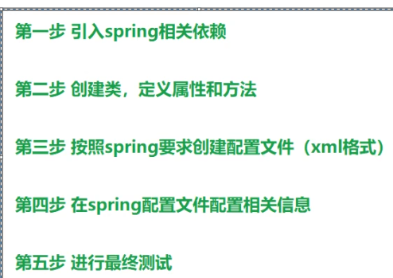
   注意：其中配置文件放在src/main/resources文件夹中
***

## day0918 Spring学习 Maven Log4j2
### Spring入门 自动装配对象的流程
1. 首先在resources文件中创建xml文件（右键resources-新建-xml配置文件-spring） 随便命名如"beans.xml"

   `0918困难：不出现xml配置文件等内容 需将idea升级为专业版`
2. 在"beans.xml"文件中添加需要自动加载的类：
   ```xml
   <bean id="user" class="org.example.User"></bean>
   ```
3. 在需要引用对象的时候，先获取ApplicationContext ac，使用ac上下文来获取已经自动装配的类对象：
   ```java
   package org.example;
   import org.junit.jupiter.api.Test;
   import org.springframework.context.ApplicationContext;
   import org.springframework.context.support.ClassPathXmlApplicationContext;
   
   public class TestUser {
   @Test
   public void test() {
      ApplicationContext ApplicationContext = new ClassPathXmlApplicationContext("beans.xml");
      User user = (User) ApplicationContext.getBean("user");
      user.add();
    }
   }
   ```
   `0918困难： jdk8无法使用spring-context6.0以上，只能使用5.x版本 所以下载jdk17 并在项目结构中选择新版本`
4. 自动装配原理分析：
   - 创建对象时，会执行无参构造
   - 反射
      - 通过解析xml文件中的bean标签的id和class
      - 使用反射根据类全路径来创建对象
        - 反射类对象 Class clazz = Class.forName("bean标签中的全路径")
        - 创建对象 clazz.getDeclaredConstructor().newInstance()
   - 创建的类放在了容器中 
     ```java
     DefaultListableBeanFactory.java:
     Map<String,BeanDefinition> beanDefinitionMap ...
     ``` 
      - key:String，对应bean标签的id
      - value：类的描述信息
### Log4j2
1. 日志可以记录并监控系统状态，能够帮助定位、诊断
2. 代替System.out等打印语句
3. 引入Log4j2：
   ```xml
   <!--log4j2的依赖-->
   <dependency>
       <groupId>org.apache.logging.log4j</groupId>
       <artifactId>log4j-core</artifactId>
       <version>2.19.0</version>
   </dependency>
   <dependency>
       <groupId>org.apache.logging.log4j</groupId>
       <artifactId>log4j-slf4j2-impl</artifactId>
       <version>2.19.0</version>
   </dependency>
   ```
   加入日志配置文件：  
在类的根路径下（resources文件夹）提供log4j2.xml配置文件（文件名固定为：log4j2.xml，文件必须放到类根路径下。）
   ```xml
   <?xml version="1.0" encoding="UTF-8"?>
   <configuration>
       <loggers>
           <!--
               level指定日志级别，从低到高的优先级：
                   TRACE < DEBUG < INFO < WARN < ERROR < FATAL
                   trace：追踪，是最低的日志级别，相当于追踪程序的执行
                   debug：调试，一般在开发中，都将其设置为最低的日志级别
                   info：信息，输出重要的信息，使用较多
                   warn：警告，输出警告的信息
                   error：错误，输出错误信息
                   fatal：严重错误
           -->
           <root level="DEBUG">
               <appender-ref ref="spring6log"/>
               <appender-ref ref="RollingFile"/>
               <appender-ref ref="log"/>
           </root>
       </loggers>
   
       <appenders>
           <!--输出日志信息到控制台-->
           <console name="spring6log" target="SYSTEM_OUT">
               <!--控制日志输出的格式-->
               <PatternLayout pattern="%d{yyyy-MM-dd HH:mm:ss SSS} [%t] %-3level %logger{1024} - %msg%n"/>
           </console>
   
           <!--文件会打印出所有信息，这个log每次运行程序会自动清空，由append属性决定，适合临时测试用-->
           <File name="log" fileName="d:/JavaCode/Idea_Projects/spring6_log/test.log" append="false">
               <PatternLayout pattern="%d{HH:mm:ss.SSS} %-5level %class{36} %L %M - %msg%xEx%n"/>
           </File>
   
           <!-- 这个会打印出所有的信息，
               每次大小超过size，
               则这size大小的日志会自动存入按年份-月份建立的文件夹下面并进行压缩，
               作为存档-->
           <RollingFile name="RollingFile" fileName="d:/spring6_log/app.log"
                        filePattern="log/$${date:yyyy-MM}/app-%d{MM-dd-yyyy}-%i.log.gz">
               <PatternLayout pattern="%d{yyyy-MM-dd 'at' HH:mm:ss z} %-5level %class{36} %L %M - %msg%xEx%n"/>
               <SizeBasedTriggeringPolicy size="50MB"/>
               <!-- DefaultRolloverStrategy属性如不设置，
               则默认为最多同一文件夹下7个文件，这里设置了20 -->
               <DefaultRolloverStrategy max="20"/>
           </RollingFile>
       </appenders>
   </configuration>
   ```
4. 使用日志，手动添加日志
   首先创建针对当前类（如TestUser）的Logger对象 之后使用logger.info("");打印
   ```java
   private Logger logger = LoggerFactory.getLogger(HelloWorldTest.class);
   //某一行
   logger.info("执行成功");
   ```
### IoC容器 Inversion of Control 控制反转
1. Spring 通过 IoC 容器来管理所有 Java 对象的实例化和初始化，控制对象与对象之间的依赖关系。我们将由 IoC 容器管理的 Java 对象称为 Spring Bean，它与使用关键字 new 创建的 Java 对象没有任何区别。
2. 将对象的创建权利交出去，交给第三方容器负责。  
将对象和对象之间关系的维护权交出去，交给第三方容器负责。  
`0918问题：markdown换行：两个空格加Enter`
3. 如何实现控制反转的？DI（Dependency Injection）：依赖注入
4. 实现过程：  
   - xml配置文件中有Bean的定义信息（bean标签）
   - 存在一个接口BeanDefinitionReader，用于读取Bean定义信息，其不同的实现类对应xml配置文件、注解方式等不同方式
   - 读取Bean定义信息后放入IoC容器中，之后开始实例化
   - 实例化过程使用：工厂模式（BeanFactory）+反射
   - 初始化
   - 最终对象，通过SpringContext.getBean("bean id")向外提供
5. 依赖注入的实现：Spring创建对象的过程中，将对象依赖属性通过配置进行注入：  
set注入和set注入两种
6. Bean管理：Bean对象的创建，以及Bean对象中属性的赋值（或者Bean对象之间关系维护，类中有另一类的对象）
7. IoC容器管理bean，创建bean之前创建IoC容器，Spring中提供了两种IoC容器实现：  
   - BeanFactory：Spring内部
   - ApplicationContext接口：BeanFactory提供的子接口，面向开发者！！！
   - ApplicationContext有多个实现类：
     - ConfigurableApplicationContext ApplicationContext的直接子接口，具有启动关闭和刷新上下文的能力
     - ClassPathXmlApplicationContext 读取类路径下的XML配置文件创建IOC容器对象 经常用!
     - FileSystemXmlApplicationContext 读取文件系统的XML配置文件创建IOC容器对象
     - WebApplicationContext 专门为Web创建IOC容器对象
   - 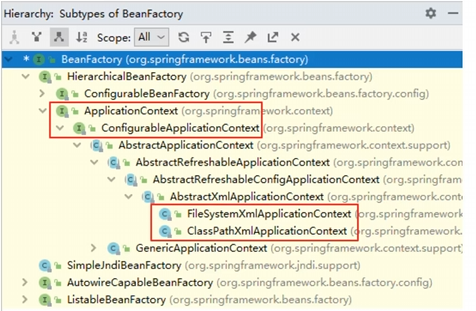
### IoC容器：基于XML获取bean
1. 获取bean，首先获取容器
   - 通过xml配置文件中给的id  注意返回Object对象
   ```java
   User user = (User) context.getBean("user");
   ```
   - 根据类的类型.class 来获取bean，注意这种要求容器中只能有一个该类型的bean 否则不知道哪一个
   ```java
   User user = (User) context.getBean(User.class);
   ```
   - 根据id和类型 两者一起获取bean
   ```java
   User user = (User) context.getBean("user",User.class);
   ```
2. 接口可以有实现类，并且可以有多个实现类，根据向上转型：可以由接口的引用接收实现类的对象实例  
那么根据xml配置实现类，可以实现接口对象的装配吗？可以，注意xml文件中只标注实现类，不能标注接口（不能new）
   ```xml
       <bean id="UserDaoImpl" class="bean.UserDaoImpl"></bean>
   ```
测试直接使用接口类名去实现自动装配！！！：
   ```java
       ApplicationContext context = new ClassPathXmlApplicationContext("bean.xml");
       UserDao userDao = (UserDao) context.getBean(UserDao.class);
       System.out.println(userDao);
       
       //输出：bean.UserDaoImpl@9d157ff
   ```
可以看到，在xml中只标注实现类的id和类型，也可以实现接口类名的自动装配，返回的依然是实现类的对象！！  
一句话：如果组件类（在xml标注的）实现了接口，根据接口类型可以获取到bean  
如果接口有多个实现类，还可以吗？不可以！：
   ```xml
       <bean id="UserDaoImpl" class="bean.UserDaoImpl"></bean>
       <bean id="UserDaoImpl2" class="bean.UserDaoImpl2"></bean>
   
   ```
   ```java
        UserDao userDao = (UserDao) context.getBean(UserDao.class);
        //输出：NoUniqueBeanDefinitionException: No qualifying bean of type 'bean.UserDao' available: expected single matching bean but found 2: UserDaoImpl,UserDaoImpl2
   ```
原因：接口类型可以接收实现类对象，而现在实现类有两个，不唯一（仍然对应根据类的类型.class 来获取bean，注意这种要求容器中只能有一个该类型的bean 否则不知道哪一个）  
一句话：一个接口有多个实现类，这些实现类都配置了bean，根据接口类型不能获取到bean
### IoC容器：基于XML 依赖注入（创建对象时设置属性值）
1. “依赖”这个词在这里指的是一个对象所依赖的其他对象或服务。在软件设计中，一个类或组件往往需要与其他类或组件交互来完成其功能，这些被交互的类或组件就构成了当前类的“依赖”。例如，一个用户服务类可能依赖于一个数据访问对象（DAO）来持久化用户数据。  
依赖注入的“注入”是指容器在运行时将依赖的实例“注入”到需要它们的对象中。这个过程可以是显式的，也可以是隐式的。显式注入通常是通过构造函数、工厂方法或setter方法来实现的，而隐式注入则可能通过注解或约定来实现。  
类型安全：Spring 会尝试将字符串值转换为属性所期望的类型。如果转换不可能（例如，字符串不是一个有效的整数表示），则 Spring 会抛出异常
2. setter注入  
   - 在类中加入各个属性的setter方法 （alt+insert键）  
   - 通过配置xml文件中 bean标签中加入property标签，将属性值填入，之后自动调用setter方法
     ```xml
        <bean id="book" class="DI.Book">
          <property name="bname" value="Book Name"></property>
          <property name="author" value="Whq"></property>
         </bean>
     ```
   这样IOC容器中装配对象时会自动调用setter对属性值进行注入
3. 构造器注入
   - 在类中加入有参构造（无参构造保留 否则会报错）
   - xml文件的bean标签中加入constructor-arg 标签
   ```xml
   <bean id="bookCon" class="DI.Book">
        <constructor-arg name="bname" value="Java"></constructor-arg>
        <constructor-arg name="author" value="Whqq"></constructor-arg>
    </bean>
   ```
   这样IOC容器中装配对象时会自动调用构造方法对属性值进行注入
4. 特殊值注入处理
   - 字面量 bean标签中的value属性值即为字面量 
   - null bean标签不能写value值（否则表示字符串"null"），而是在property下写<null></null> 标签表示空值注入
   - xml实体 也就是xml中有些符号无法使用 需要用转义字符 比如小于号 &lt;  写法value="a &lt; b"
   - CDATA节 不使用转义字符 而是使用CDATA节，同样可以实现同样功能
   ```xml
   <propery name="">
    <value><![CDATA[a<b]]></value> 
   </propery>> 
   ```
5. 对象属性注入
例子：部门与员工 1：n  
   - 外部bean引入
      - 在员工的bean当中使用ref 引用部门的id值，注意普通属性用value，对象属性用ref ：
   ```xml
       <bean id="dept_one" class="bean.Dept">
           <property name="dept_name" value="SEU"></property>
       </bean>
   
       <bean id="emp" class="bean.Emp">
           <property name="empname" value="xiaowang"></property>
           <property name="dept" ref="dept_one"></property>
       </bean>
   ```
   - 内部bean
     - 在一个bean中再声明一个bean就是内部bean
     - 内部bean只能用于给属性赋值，不能在外部通过IOC容器获取，因此可以省略id属性
   ```xml
       <!-- 这个用于IOC创建 -->
       <bean id="dept_one" class="bean.Dept">
           <property name="dept_name" value="SEU"></property>
       </bean>
       
       <bean id="emp" class="bean.Emp">
           <property name="empname" value="xiaowang"></property>
           <property name="dept">
               <!--内部bean仅用于属性赋值 -->
               <bean id="dept_one" class="bean.Dept">
                   <property name="dept_name" value="SEU"></property>
               </bean>
           </property>
       </bean>
   ```
   - 级联赋值
     - 直接为对象属性的属性赋值
   ```xml
       <bean id="dept_one" class="bean.Dept">
           <property name="dept_name" value="SEU"></property>
       </bean>
   
       <bean id="emp" class="bean.Emp">
           <property name="empname" value="xiaowang"></property>
           <property name="dept.name" value="dept_one_name"></property>
       </bean>
   ```
6. 数组注入：
<property>标签下写<array>标签 之后可以用value或者ref（对象）赋值
```xml
    <property name="hobbies">
        <array>
            <value>抽烟</value>
            <value>喝酒</value>
            <value>烫头</value>
        </array>
    </property>
```
List的话，则只需要将<array>改为<list>
map的话，则是<map><entry><key value> <value>或者<ref>  
list和map可以使用<util:list id="list">  <util:map id="map">  
需要加入xmlns:util约束  
之后在注入属性时使用ref="list"或ref="map"即可
7. p命名空间
先引入p命名空间  
   ```xml
   <bean id="studentSix" class="com.atguigu.spring6.bean.Student"
       p:id="1006" p:name="小明" p:clazz-ref="clazzOne" p:teacherMap-ref="teacherMap"></bean>
   ```
8. 引入外部属性文件  
jdbc 先引入依赖 后配置jdbc.properties 之后xml文件配置context和bean：  
   ```xml
   <!-- 引入外部属性文件 -->
   <context:property-placeholder location="classpath:jdbc.properties"/>
   ```
## day0919 IOC
### IOC继续
1. bean标签的scope属性（是否单实例）：
   - singleton（默认） 在IOC容器中，这个bean对象始终为单实例  在IOC容器初始化时创建对象
   - prototype        在IOC容器中有多个实例  在获取bean时（即getBean）才创建对象
   - request 在一个请求的范围内有效
   - session 在一个会话范围内有效
2. bean的生命周期（bean对象从创建到销毁）
   - bean对象创建(调用无参构造)
   - 给bean设置注入属性（注入setter或构造器）
     - property标签 name value/ref
   - bean后置处理器（初始化之前）
   - bean对象初始化（调用指定初始化方法 比如手动创建的void initMethod()）
     - 在bean标签中使用init-method="initMethod" 
   - bean后置处理器（初始化之后）
   - 创建完成
   - bean对象销毁（配置指定销毁方法 比如手动创建的void destroyMethod()）
     - 在bean标签中使用destroy-method="destroyMethod" 
     - ApplicationContext的实现类 ClassPathXmlApplicationContext类中context.close()方法销毁
   - 直至IOC容器关闭
3. 后置处理器 beanPost  
   - 新建一个类（如MyBeanPost）实现BeanPostProcessor接口
   - 接口中有两个方法:
     - Object postProcessBeforeInitialization(Object bean,String beanName)
     - Object postProcessAfterInitialization(Object bean,String beanName)
   - 实现接口的方法后，可以在xml进行配置后置处理器：
   ```xml
   <!-- bean的后置处理器要放入IOC容器才能生效 -->
   <bean id="myBeanProcessor" class="org.life.MyBeanProcessor"/>
   ```
4. FactoryBean 注意不是BeanFactory(用来返回Bean的工厂模式)
   - 使用时 先实现FactoryBean<T> 接口 一个返回对象，一个返回类：
   ```java
   package com.atguigu.spring6.bean;
   public class UserFactoryBean implements FactoryBean<User> {
      @Override
      public User getObject() throws Exception {
         return new User();
      }
   
       @Override
       public Class<?> getObjectType() {
           return User.class;
       }
   }
   ```
   - 在xml中配置bean标签，注意id仍是想获得的类或者随便命名（实际由getObject方法返回），而class则是UserFactoryBean
   ```xml
   <bean id="user" class="com.atguigu.spring6.bean.UserFactoryBean"></bean>
   ```
   - 重要：这样虽然xml配置的时factoryBean，但是实际获得的是根据重写的getObject()方法返回的对象
   - 通过这种机制，Spring可以帮助把复杂组件创建的详细过程和繁琐细节屏蔽，把简介使用界面展现给程序员
5. xml自动装配："autowire=byType/byName"  
不用再写<property>标签手动setter注入了
   - 自动装配方式：byType
      - spring容器会遍历当前bean标签的class字段对应的类中所有的setter方法，会在容器中查找和set参数类型相同的bean对象，将其通过setter方法进行注入，未找到对应类型的bean对象则setter方法不进行注入。
      - 需要注入的set属性的类型和被注入的bean的类型需要满足a.isAssignableFrom(b)关系 即a与b同类型或者b能够转换为a
      - byType：根据类型匹配IOC容器中的某个兼容类型的bean，为属性自动赋值 
      - 若在IOC中，没有任何一个兼容类型的bean能够为属性赋值，则该属性不装配，即值为默认值null 
      - 若在IOC中，有多个兼容类型的bean能够为属性赋值，则抛出异常NoUniqueBeanDefinitionException
   - 自动装配方式：byName 
     - byName：将自动装配的属性的属性名，作为bean的id在IOC容器中匹配相对应的bean进行赋值
     - spring容器会按照set的属性的名称去容器中查找与当前bean对象属性同名的bean对象(id)，然后将查找到的对象通过setter方法注入到当前bean中，未找到对应名称的bean对象则setter方法不进行注入 要注入的set属性的名称和被注入的bean的名称必须一致
### 基于注解管理Bean 简化xml配置
1. 总的流程
   - 引入依赖 依然是spring-context
   - 开启组件扫描 
     - Spring 默认不使用注解装配 Bean
     - 因此我们需要在 Spring 的 XML 配置中，通过 context:component-scan 元素开启 Spring Beans的自动扫描功能。
     - 开启此功能后，Spring 会自动扫描指定的包（base-package 属性设置）及其子包下的所有类，如果类上使用了 @Component 注解，就将该类装配到容器中。
   ```xml
    <context:component-scan base-package="com.atguigu.spring6"></context:component-scan>
   ```
      - 注意要加入xmln:context约束和xsi:schemaLocation中加入context
      - 排除某些组件
   ```xml
   <context:component-scan base-package="com.atguigu.spring6">
   <!-- context:exclude-filter标签：指定排除规则 -->
   <!-- 
        type：设置排除或包含的依据
       type="annotation"，根据注解排除，expression中设置要排除的注解的全类名
       type="assignable"，根据类型排除，expression中设置要排除的类型的全类名
   -->
   <context:exclude-filter type="annotation" expression="org.springframework.stereotype.Controller"/>
   <!--<context:exclude-filter type="assignable" expression="com.atguigu.spring6.controller.UserController"/>-->
   </context:component-scan>
   ```
      - 只扫描指定组件
   ```xml
   <context:component-scan base-package="com.atguigu" use-default-filters="false">
   <!-- context:include-filter标签：指定在原有扫描规则的基础上追加的规则 -->
   <!-- use-default-filters属性：取值false表示关闭默认扫描规则 -->
   <!-- 此时必须设置use-default-filters="false"，因为默认规则即扫描指定包下所有类 -->
   <!-- 
        type：设置排除或包含的依据
       type="annotation"，根据注解排除，expression中设置要排除的注解的全类名
       type="assignable"，根据类型排除，expression中设置要排除的类型的全类名
   -->
   <context:include-filter type="annotation" expression="org.springframework.stereotype.Controller"/>
   <!--<context:include-filter type="assignable" expression="com.atguigu.spring6.controller.UserController"/>-->
   </context:component-scan>
   ```
2. 注解定义Bean 直接在类上标注注解即可 四种注解功能相同，只不过后面三个对应不同层 名字不同
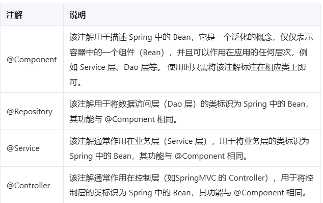
3. 例子 若不标注value则自动将类名首字母小写即user
   ```java
      @Component(value = "user") //作用同xml中<bean id="user" class="...">
      public class User {
      }
   ```
4. @Autowired注解  
   - 可以注解在构造方法上 方法上 形参上 属性上 注解上
   - 属性注入，根据类型装配(会自动判断是否有某个兼容类型) 【默认是byType】
     - 例子，在UserServiceImpl中自动注入UserDao，在UserController中自动注入UserService
        ```java
        @Autowired
       private UserDao userDao;


        @Autowired
        private UserService userService;
        ```
     - 以上构造方法和setter方法都没有提供，经过测试，仍然可以注入成功。
   - setter方法注入
     - 定义属性后，加入setter方法，在setter方法上加上@Autowired注解
   ```java
   private UserDao userDao;
   
       @Autowired
       public void setUserDao(UserDao userDao) {
           this.userDao = userDao;
       }
   ```
   - 构造方法注入
     - 定义属性后加入构造方法，在之上加上@Autowired注解
     - 也可以放在构造方法形参上注入
     - 若只有一个有参数构造函数（此时也不能有无参构造），则可以不写注解 也可以实现自动注入
   ```java
   //@Autowired
   public UserServiceImpl(@Autowired UserDao userDao) {
      this.userDao = userDao;
   }
   ```
5. @Autowired和@Qualifier注解 byName注入
如果一个接口（比如UserDao）有两个实现类（UserDaoImpl和UserDaoRedisImpl），那么此时不能自动进行装配（byType异常）  
此时需要用byName进行装配
   ```java
   @Autowired
   @Qualifier("userDaoImpl") // 指定bean的名字
   private UserDao userDao;
   ```
@Qualifier注解主要用于指定bean名字
6. @Resource注解  
   - 也可以完成属性注入，同@Autowired功能
   - 是JDK（而非Spring）扩展包注解，即标准注解，更具通用性
   - 默认byName(Bean的id或者@Componet的value值)，未指定name时使用属性名（即定义的对象名）作为name。若找不到，则通过byType通过类型注入
   - @Autowired默认byType，若byName需要配合@Qulifier
   - @Resource只能用在属性上和setter方法上
   - 由于是JDK拓展包，因此需要额外引入依赖 jakarta.annotation
### Spring全注解开发 使用配置类代替xml配置文件
1. 建立配置类：类上加入注解@Configuration
2. 开启组件扫描：在类上加上注解@ComponentScan("扫描包名")
3. 使用时不再是找xml配置文件，而是使用AnnotationConfigApplicationContext(配置类.class)加载配置类：
```java
   @Test
   public void testAllAnnotation(){
       ApplicationContext context = new AnnotationConfigApplicationContext(Spring6Config.class);
       UserController userController = context.getBean("userController", UserController.class);
       userController.out();
       logger.info("执行成功");
   }
```
## day0920 IOC手动实现
### IOC手动实现
1. 创建注解@Bean(同@Component)和@Di(同@Autowired)
   ```java
   @Target(ElementType.TYPE)
   @Retention(RetentionPolicy.RUNTIME)
   public @interface Bean {
   }  
   
   @Target(ElementType.FIELD)
   @Retention(RetentionPolicy.RUNTIME)
   public @interface Di {
   }
   ```
2. @Bean 建立工厂模式的IOC容器 
   - 建立接口ApplicationContext
   - IOC容器map
   - 返回单实例
   - 包扫描路径，使用构造函数实现，扫描哪个类有注解，并通过反射进行实例化
   - 实例化后放入Map中，供以后使用
3. 列出当前文件夹下的资源：
   ```java
   Enumeration<URL> resources = Thread.currentThread()
                                               .getContextClassLoader()
                                               .getResources(basePackage);
   ```
4. 判断文件类型:路径判断后缀名
   ```java
   pak_class_path.contains(".class")
   ```
5. 出现了两个错误：一个是要记住Java变量修改后要保存 另外".class"替换为"" 记住有"."
6. 自动注入 @Di  
   - 也是在ApplicationContext的构造函数中实现
   - 遍历当前所有加载了的IOC容器里的对象（即Map中的），得到所有已经加载的类
   `Map的遍历：Map.EntrySet方法，然后用set遍历`
   - 找到已加载的类的所有field属性字段，看是否有@Di注解 
   - 若有@Di则将该field进行set，也就是把map里面的(field.getType)对象注入到这个field中
   - 注意先将Accessible设置为true 从而注入private对象
7. 这个IOC没有考虑一个接口有多个实现类，所以可以进行改进：  
将Map<Class,Object> 改进为Map<Class,Map<String,Object>>  
内部Map的String对应注解@Bean的一个新增属性name（用来指定 bean 的唯一名称）

### AOP
1. 现在如果我们要实现附加功能如日志，都需要在实现类或方法中添加日志代码，对实际业务代码有干扰，并且附加功能分散于业务中，不利于统一维护：
   ```java
   public class CalculatorLogImpl implements Calculator {
       
       @Override
       public int add(int i, int j) {
       
           System.out.println("[日志] add 方法开始了，参数是：" + i + "," + j);
       
           int result = i + j;
       
           System.out.println("方法内部 result = " + result);
       
           System.out.println("[日志] add 方法结束了，结果是：" + result);
       
           return result;
       }
   ```
   解决问题的困难：要抽取的代码在方法内部，靠以前把子类中的重复代码抽取到父类的方式没法解决。所以需要引入新的技术。
2.  二十三种设计模式中的一种，属于结构型模式  
它的作用就是通过提供一个代理类，让我们在调用目标方法的时候，不再是直接对目标方法进行调用，而是通过代理类间接调用   
让不属于目标方法核心逻辑的代码从目标方法中剥离出来——解耦。调用目标方法时先调用代理对象的方法，减少对目标方法的调用和打扰，同时让附加功能能够集中在一起也有利于统一维护
3. 静态代理：就是封装一个代理类，然后这个代理类去调用原来实现类  
将日志功能集中到一个代理类中，将来有任何日志需求，都通过这一个代理类来实现。这就需要使用动态代理技术了
4. 动态代理
   - 只需要一个代理类
   - 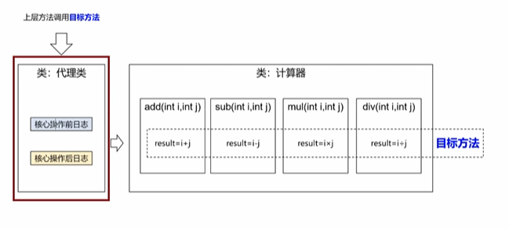
   ```java
   public class ProxyFactory {
   
      private Object target;
   
      public ProxyFactory(Object target) {
         this.target = target;
      }
   
      public Object getProxy(){
   
         /**
          * newProxyInstance()：创建一个代理实例
          * 其中有三个参数：
          * 1、classLoader：加载动态生成的代理类的类加载器
          * 2、interfaces：目标对象实现的所有接口的class对象所组成的数组
          * 3、invocationHandler：设置代理对象实现目标对象方法的过程，即代理类中如何重写接口中的抽象方法
          */
         ClassLoader classLoader = target.getClass().getClassLoader();
         Class<?>[] interfaces = target.getClass().getInterfaces();
         InvocationHandler invocationHandler = new InvocationHandler() {
            @Override
            public Object invoke(Object proxy, Method method, Object[] args) throws Throwable {
               /**
                * proxy：代理对象
                * method：代理对象需要实现的方法，即其中需要重写的方法
                * args：method所对应方法的参数
                */
               Object result = null;
               try {
                  System.out.println("[动态代理][日志] "+method.getName()+"，参数："+ Arrays.toString(args));
                  result = method.invoke(target, args);
                  System.out.println("[动态代理][日志] "+method.getName()+"，结果："+ result);
               } catch (Exception e) {
                  e.printStackTrace();
                  System.out.println("[动态代理][日志] "+method.getName()+"，异常："+e.getMessage());
               } finally {
                  System.out.println("[动态代理][日志] "+method.getName()+"，方法执行完毕");
               }
               return result;
            }
         };
   
         return Proxy.newProxyInstance(classLoader, interfaces, invocationHandler);
      }
   }
   ```
   - 解释代码：
     - 代理类工厂，工厂类中的object对象作为以后需要加入附加功能的类对象（通过工厂的构造函数），之后调用工厂的getProxy获得带有附加代理功能的原始类对象，该对象可以调用原本的类的方法
     ```java
      @Test
      public void testDynamicProxy(){
      ProxyFactory factory = new ProxyFactory(new CalculatorLogImpl());
      Calculator proxy = (Calculator) factory.getProxy();
      proxy.div(1,0);
      //proxy.div(1,1);
      }
      ```
     
## day0922 AOP
### AOP总体介绍
1. 是设计思想，通过*预编译方式和运行期动态代理方式*实现，不修改源码的情况下，给程序动态统一添加额外功能的一种技术
2. 可以对业务逻辑的各个部分进行隔离，降低耦合度，提高可重用性
3. 术语
   - 横切关注点
     - 逻辑概念，分散在每个各个模块中解决问题，如用户验证、日志管理、事务处理、数据缓存都属于横切关注点
     - 从每个方法中抽取出来的同一类非核心业务。在同一个项目中，我们可以使用多个横切关注点对相关方法进行多个不同方面的增强。
     - 有十个附加功能，就有十个横切关注点
     - 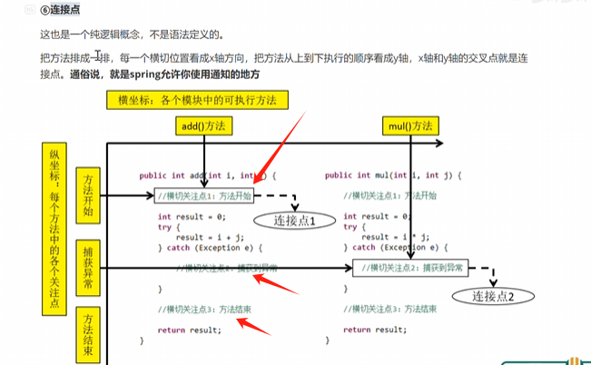
   - 通知（或这叫增强）
     - 想要增强的功能，比如安全、事务、日志等
     - 每个横切关注点要做的事情需要写一个方法来实现，这个方法就叫通知方法
     - 前置通知：在被代理的目标方法前执行
     - 返回通知：在被代理的目标方法成功结束后执行（寿终正寝）
     - 异常通知：在被代理的目标方法异常结束后执行（死于非命）
     - 后置通知：在被代理的目标方法最终结束后执行（盖棺定论）
     - 环绕通知：使用try…catch…finally结构围绕整个被代理的目标方法，包括上面四种通知对应的所有位置
   - 切面
      - 封装通知方法的类
      - 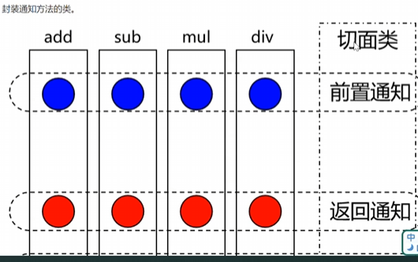
   - 目标
     - 被代理的目标对象  对象！对象！对象！(上述代码中构造方法中传递的参数new CalculatorImpl())
   - 代理
     - 向目标对象应用统治之后创建的代理对象 (上述代码中工厂get方法返回的proxy对象)
   - 连接点
     - 逻辑概念
     - 也就是spring允许使用通知的地方
     - 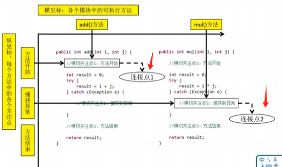
   - 切入点
     - 定位连接点的方式
     - 每个类的方法中包含多个连接点，怎么去查找连接点，就是切入点的事情
     - 将连接点看作数据库的记录，切入点就是sql查询语句
     - Spring的AOP可以通过切入点定位连接点，即定位需要增强的方法位置
     - org.springframework.aop.Pointcut接口描述，使用类和方法作为连接点的查询条件
### Spring基于注解的AOP
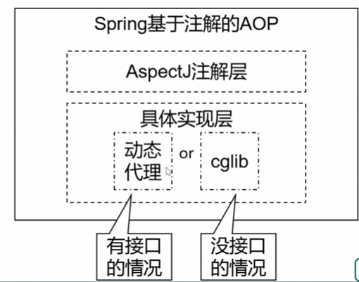
1. 动态代理的分类
   - JDK动态代理
     - 代理的对象有接口的情况，通过JDK动态代理生成接口实现类代理对象
     - 需要被代理目标类必须实现接口，要求代理对象和目标对象实现同样的接口
     - 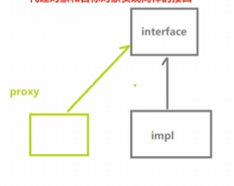
   - cglib动态代理
     - 代理的对象没有接口的情况
     - 通过继承被代理的目标类来实现代理，不需要目标类再实现接口
     - 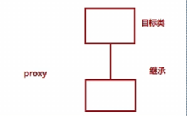
2. AspectJ：是AOP思想的一种实现。
   - 本质上是静态代理，将代理逻辑”织入“被代理的目标类编译得到的字节码文件中，所以最终效果意识动态的
   - weaver是织入器，Spring只是借用了AspectJ的注解
3. 步骤：
   - 引入aop和aspects依赖
   - 创建目标接口和实现类 如Calculator和CalculatorImpl
   - 在resources中添加配置文件 bean.xml
     - 约束新增aop
     - 开启组件扫描 context:component-scan
     - 开启Aspectj自动代理，为目标对象生成代理
       - <aop:aspectj-autoproxy></aop:aspectj-autoproxy>
   ```xml
    <?xml version="1.0" encoding="UTF-8"?>
    <beans xmlns="http://www.springframework.org/schema/beans"
    xmlns:xsi="http://www.w3.org/2001/XMLSchema-instance"
    xmlns:context="http://www.springframework.org/schema/context"
    xmlns:aop="http://www.springframework.org/schema/aop"
    xsi:schemaLocation="http://www.springframework.org/schema/beans
    http://www.springframework.org/schema/beans/spring-beans.xsd
    http://www.springframework.org/schema/context
    http://www.springframework.org/schema/context/spring-context.xsd
    http://www.springframework.org/schema/aop
    http://www.springframework.org/schema/aop/spring-aop.xsd">
    <!--
        基于注解的AOP的实现：
        1、将目标对象和切面交给IOC容器管理（注解+扫描）
        2、开启AspectJ的自动代理，为目标对象自动生成代理
        3、将切面类通过注解@Aspect标识
    -->
    <context:component-scan base-package="com.atguigu.aop.annotation"></context:component-scan>
    
        <aop:aspectj-autoproxy />
    </beans>
    ```
    - 创建切面类
        - 加上注解@Aspect和@Component
        - 切入点表达式语法
          - 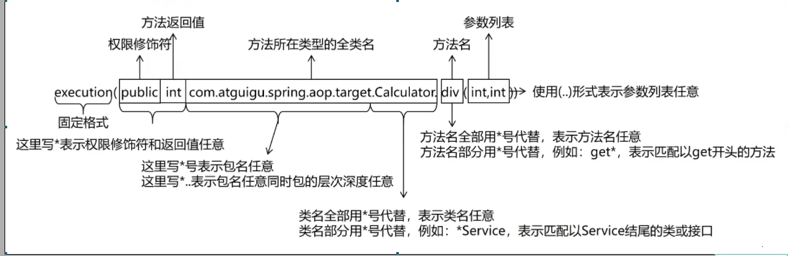
        - 通知类型（方法前@Before()、方法后@After、异常@AfterThrowing、返回@AfterReturning、环绕@Around）
          - 每个注解都有一个属性 切入点表达式配置切入点（即表达式）
          - @AfterReturning注解有returning属性，可以给返回对象起名，这样在方法参数中可以用Object result接收目标方法结果
          - @Around注解可以在方法参数中加入更高级的ProceedingJoinPoint 并且环绕需要将结果进行返回！见代码
    ```java
    package annoaop;

    import org.aspectj.lang.ProceedingJoinPoint;
    import org.aspectj.lang.annotation.Around;
    import org.aspectj.lang.annotation.Aspect;
    import org.springframework.stereotype.Component;
    
    import java.util.Arrays;
    
    @Aspect
    @Component
    public class LogAspect {
    //    @Before(value = "execution(* annoaop.*.*(..))")
    //    public void beforeMethod(){
    //        System.out.println("[Logger] 前置通知");
    //    }
    
        @Around(value = "execution(* annoaop.*.*(..))")
        public Object aroundMethod(ProceedingJoinPoint joinPoint){
            String methodName = joinPoint.getSignature().getName();
            Object[] args = joinPoint.getArgs();
            String argsString = Arrays.toString(args);
            Object result = null;
            try {
                System.out.println("[Logger] 环绕通知:方法前，"+"目标方法："+methodName+"参数："+argsString);
                result = joinPoint.proceed();
                System.out.println("[Logger] 环绕通知:方法后，"+"目标方法："+methodName+"参数："+argsString);
            }catch (Throwable e){
                System.out.println("[Logger] 环绕通知:方法异常时，"+"目标方法："+methodName+"参数："+argsString);
            }finally {
                System.out.println("[Logger] 环绕通知:方法执行完毕，"+"目标方法："+methodName+"参数："+argsString);
            }
            return result;
        }
    }

    ```
    `0922问题：输出数组 Arrays.toString(数组)`
4. 重用切入点表达式
    ```java
    //重用切入点表达式声明
    @Pointcut("execution(* com.atguigu.aop.annotation.*.*(..))")
    public void pointCut(){}
   
    //在同一个切面中使用（切面类）
    @Before("pointCut()")
    public void beforeMethod(JoinPoint joinPoint){
        String methodName = joinPoint.getSignature().getName();
        String args = Arrays.toString(joinPoint.getArgs());
        System.out.println("Logger-->前置通知，方法名："+methodName+"，参数："+args);
    }

    //在不同切面中使用（切面类）
    @Before("com.atguigu.aop.CommonPointCut.pointCut()")
    public void beforeMethod(JoinPoint joinPoint){
        String methodName = joinPoint.getSignature().getName();
        String args = Arrays.toString(joinPoint.getArgs());
        System.out.println("Logger-->前置通知，方法名："+methodName+"，参数："+args);
    }


    ```


        
            

### Spring基于xml的AOP
1. xml中开启组件扫描
2. 加入<aop:config>
    - 配置切面类 <aop:aspect>
    - 配置切入点 <aop:pointcut>
    - 配置通知类型 
      - <aop:before after ...>