# 苍穹外卖

## 苍穹外卖项目介绍

在开发苍穹外卖这个项目之前，我们需要全方位的来介绍一下当前我们学习的这个项目。接下来，我们将从项目简介、产品原型、技术选型三个方面来介绍苍穹外卖这个项目。

### 项目介绍

本项目（苍穹外卖）是专门为餐饮企业（餐厅、饭店）定制的一款软件产品，包括 系统管理后台 和 小程序端应用 两部分。其中系统管理后台主要提供给餐饮企业内部员工使用，可以对餐厅的分类、菜品、套餐、订单、员工等进行管理维护，对餐厅的各类数据进行统计，同时也可进行来单语音播报功能。小程序端主要提供给消费者使用，可以在线浏览菜品、添加购物车、下单、支付、催单等。


接下来，通过功能架构图来展示**管理端**和**用户端**的具体业务功能模块。

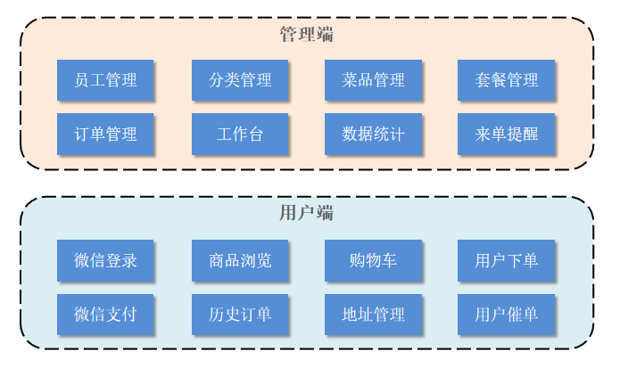

**1). 管理端功能**

员工登录/退出 , 员工信息管理 , 分类管理 , 菜品管理 , 套餐管理 , 菜品口味管理 , 订单管理 ，数据统计，来单提醒。

**2). 用户端功能**

 微信登录 , 收件人地址管理 , 用户历史订单查询 , 菜品规格查询 , 购物车功能 , 下单 , 支付、分类及菜品浏览。


### 2.2 产品原型

**产品原型**，用于展示项目的业务功能，一般由产品经理进行设计。

> **<font color='red'>注意事项：</font>** 产品原型主要用于展示项目的功能，并不是最终的页面效果。


在课程资料的产品原型文件夹下,提供了两份产品原型。

 

**管理端原型图：**

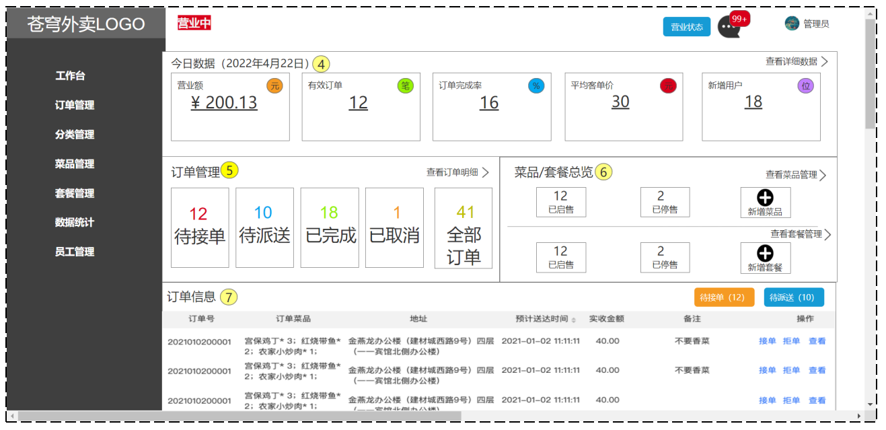

**用户端原型图：**


**1). 管理端**

餐饮企业内部员工使用。 主要功能有: 

| 模块      | 描述                                                         |
| --------- | ------------------------------------------------------------ |
| 登录/退出 | 内部员工必须登录后,才可以访问系统管理后台                    |
| 员工管理  | 管理员可以在系统后台对员工信息进行管理，包含查询、新增、编辑、禁用等功能 |
| 分类管理  | 主要对当前餐厅经营的 菜品分类 或 套餐分类 进行管理维护， 包含查询、新增、修改、删除等功能 |
| 菜品管理  | 主要维护各个分类下的菜品信息，包含查询、新增、修改、删除、启售、停售等功能 |
| 套餐管理  | 主要维护当前餐厅中的套餐信息，包含查询、新增、修改、删除、启售、停售等功能 |
| 订单管理  | 主要维护用户在移动端下的订单信息，包含查询、取消、派送、完成，以及订单报表下载等功能 |
| 数据统计  | 主要完成对餐厅的各类数据统计，如营业额、用户数量、订单等     |


**2). 用户端**

移动端应用主要提供给消费者使用。主要功能有:

| 模块        | 描述                                                         |
| ----------- | ------------------------------------------------------------ |
| 登录/退出   | 用户需要通过微信授权后登录使用小程序进行点餐                 |
| 点餐-菜单   | 在点餐界面需要展示出菜品分类/套餐分类, 并根据当前选择的分类加载其中的菜品信息, 供用户查询选择 |
| 点餐-购物车 | 用户选中的菜品就会加入用户的购物车, 主要包含 查询购物车、加入购物车、删除购物车、清空购物车等功能 |
| 订单支付    | 用户选完菜品/套餐后, 可以对购物车菜品进行结算支付, 这时就需要进行订单的支付 |
| 个人信息    | 在个人中心页面中会展示当前用户的基本信息, 用户可以管理收货地址, 也可以查询历史订单数据 |


### 2.3 技术选型

关于本项目的技术选型, 我们将会从 用户层、网关层、应用层、数据层 这几个方面进行介绍，主要用于展示项目中使用到的技术框架和中间件等。


**1). 用户层**

本项目中在构建系统管理后台的前端页面，我们会用到H5、Vue.js、ElementUI、apache echarts(展示图表)等技术。而在构建移动端应用时，我们会使用到微信小程序。


**2). 网关层**

Nginx是一个服务器，主要用来作为Http服务器，部署静态资源，访问性能高。在Nginx中还有两个比较重要的作用： 反向代理和负载均衡， 在进行项目部署时，要实现Tomcat的负载均衡，就可以通过Nginx来实现。


**3). 应用层**

SpringBoot： 快速构建Spring项目, 采用 "约定优于配置" 的思想, 简化Spring项目的配置开发。

SpringMVC：SpringMVC是spring框架的一个模块，springmvc和spring无需通过中间整合层进行整合，可以无缝集成。

Spring Task:  由Spring提供的定时任务框架。

httpclient:  主要实现了对http请求的发送。

Spring Cache:  由Spring提供的数据缓存框架

JWT:  用于对应用程序上的用户进行身份验证的标记。

阿里云OSS:  对象存储服务，在项目中主要存储文件，如图片等。

Swagger： 可以自动的帮助开发人员生成接口文档，并对接口进行测试。

POI:  封装了对Excel表格的常用操作。

WebSocket: 一种通信网络协议，使客户端和服务器之间的数据交换更加简单，用于项目的来单、催单功能实现。


**4). 数据层**

MySQL： 关系型数据库, 本项目的核心业务数据都会采用MySQL进行存储。

Redis： 基于key-value格式存储的内存数据库, 访问速度快, 经常使用它做缓存。

Mybatis： 本项目持久层将会使用Mybatis开发。

pagehelper:  分页插件。

spring data redis:  简化java代码操作Redis的API。


**5). 工具**

git: 版本控制工具, 在团队协作中, 使用该工具对项目中的代码进行管理。

maven: 项目构建工具。

junit：单元测试工具，开发人员功能实现完毕后，需要通过junit对功能进行单元测试。

postman:  接口测工具，模拟用户发起的各类HTTP请求，获取对应的响应结果。


## 3. 开发环境搭建

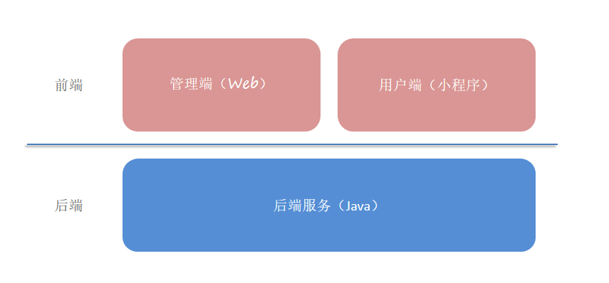

开发环境搭建主要包含**前端环境**和**后端环境**两部分。作为服务端开发工程师， 我们课程学习的重心应该放在后端的业务代码上， 前端的页面我们只需要导入资料中的nginx， 前端页面的代码我们只需要能看懂即可。


### 3.1 前端环境搭建

**1). 前端工程基于 nginx** 

从资料中找到前端运行环境的nginx，移动到**非中文目录**下。

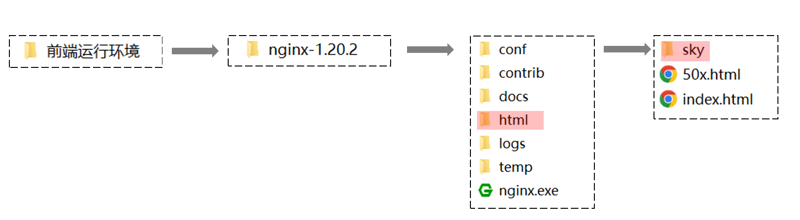

**sky**目录中存放了管理端的前端资源，具体如下：

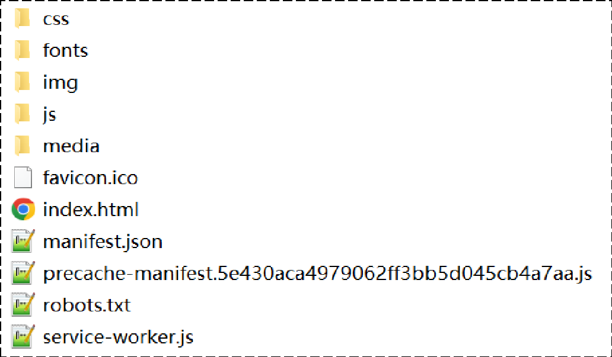

**2). 启动nginx，访问测试** 

双击 nginx.exe 即可启动 nginx 服务，访问端口号为 80

http://localhost:80


### 3.2 后端环境搭建

#### 3.2.1 熟悉项目结构

后端工程基于 maven 进行项目构建，并且进行分模块开发。

**1). 从当天资料中找到后端初始工程：**

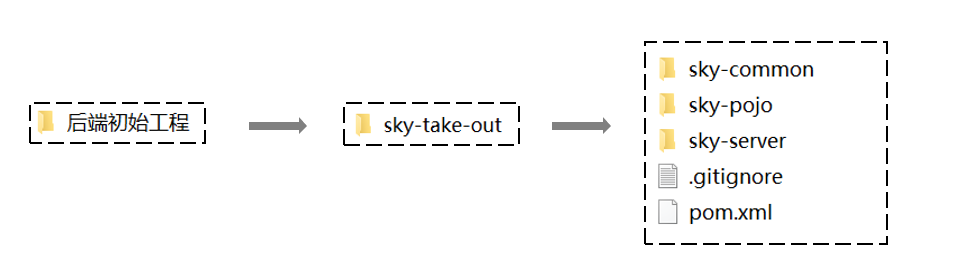

**2). 用 IDEA 打开初始工程，了解项目的整体结构：**

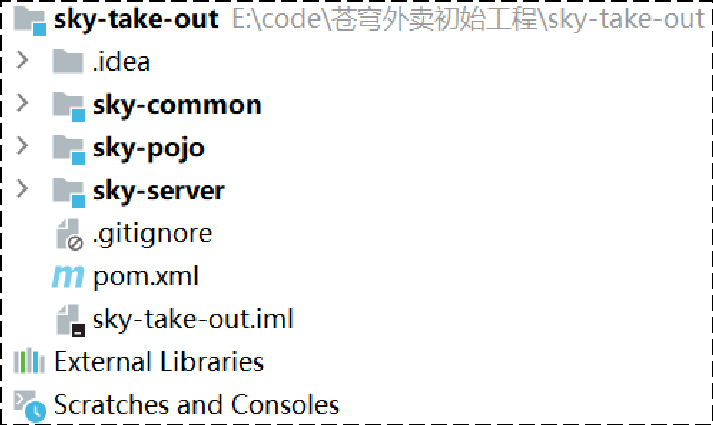

对工程的每个模块作用说明：

| **序号** | **名称**     | **说明**                                                     |
| -------- | ------------ | ------------------------------------------------------------ |
| 1        | sky-take-out | maven父工程，统一管理依赖版本，聚合其他子模块                |
| 2        | sky-common   | 子模块，存放公共类，例如：工具类、常量类、异常类等           |
| 3        | sky-pojo     | 子模块，存放实体类、VO、DTO等                                |
| 4        | sky-server   | 子模块，后端服务，存放配置文件、Controller、Service、Mapper等 |

对项目整体结构了解后，接下来我们详细分析上述的每个子模块：


- **sky-common:** 模块中存放的是一些公共类，可以供其他模块使用

  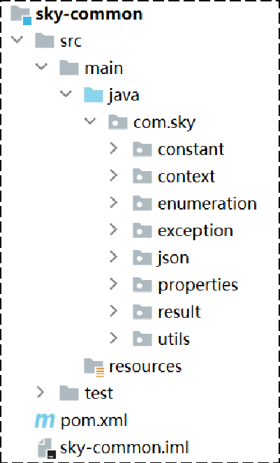

  

  分析sky-common模块的每个包的作用：

  | 名称        | 说明                           |
  | ----------- | ------------------------------ |
  | constant    | 存放相关常量类                 |
  | context     | 存放上下文类                   |
  | enumeration | 项目的枚举类存储               |
  | exception   | 存放自定义异常类               |
  | json        | 处理json转换的类               |
  | properties  | 存放SpringBoot相关的配置属性类 |
  | result      | 返回结果类的封装               |
  | utils       | 常用工具类                     |

  

- **sky-pojo:** 模块中存放的是一些 entity、DTO、VO

  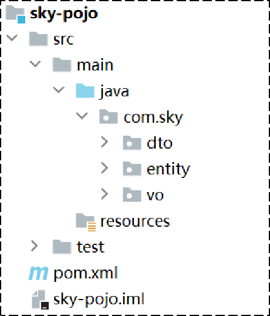

  分析sky-pojo模块的每个包的作用：

  | **名称** | **说明**                                     |
  | -------- | -------------------------------------------- |
  | Entity   | 实体，通常和数据库中的表对应                 |
  | DTO      | 数据传输对象，通常用于程序中各层之间传递数据 |
  | VO       | 视图对象，为前端展示数据提供的对象           |
  | POJO     | 普通Java对象，只有属性和对应的getter和setter |

  

- **sky-server:** 模块中存放的是 配置文件、配置类、拦截器、controller、service、mapper、启动类等

  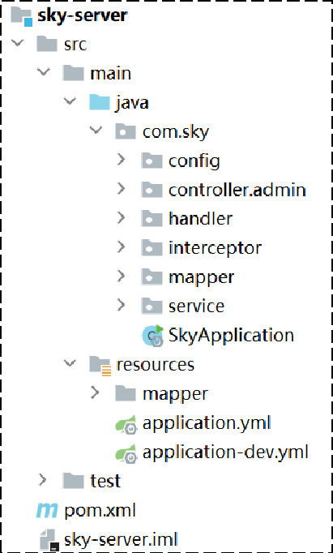

  分析sky-server模块的每个包的作用：

  | 名称           | 说明             |
  | -------------- | ---------------- |
  | config         | 存放配置类       |
  | controller     | 存放controller类 |
  | interceptor    | 存放拦截器类     |
  | mapper         | 存放mapper接口   |
  | service        | 存放service类    |
  | SkyApplication | 启动类           |


#### 3.2.3 数据库环境搭建

1. **从资料中找到sky.sql**

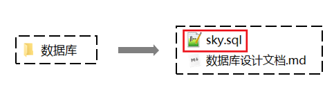

直接打开sky.sql文件


通过该sql文件直接可创建数据库，所以不需要提前创建数据库，直接导入该文件执行即可。

2. **执行sky.sql文件**

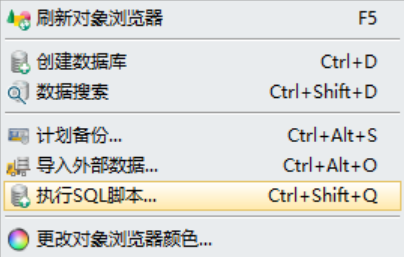

执行完成后，共创建出11张表

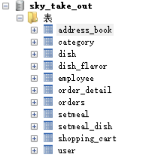

每张表的说明：

| **序号** | **表名**      | **中文名**     |
| -------- | ------------- | -------------- |
| 1        | employee      | 员工表         |
| 2        | category      | 分类表         |
| 3        | dish          | 菜品表         |
| 4        | dish_flavor   | 菜品口味表     |
| 5        | setmeal       | 套餐表         |
| 6        | setmeal_dish  | 套餐菜品关系表 |
| 7        | user          | 用户表         |
| 8        | address_book  | 地址表         |
| 9        | shopping_cart | 购物车表       |
| 10       | orders        | 订单表         |
| 11       | order_detail  | 订单明细表     |

我们目前先简单了解大概有哪些表, 每张表存储什么数据, 有一个印象。对于具体的表结构, 以及表结构中的字段, 可以参考资料中的**《数据库设计文档》**，同时在讲解具体的功能开发时, 我们也会再详细介绍。


#### 3.2.4 前后端联调

后端的初始工程中已经实现了**登录**功能，直接进行前后端联调测试即可

实现思路：

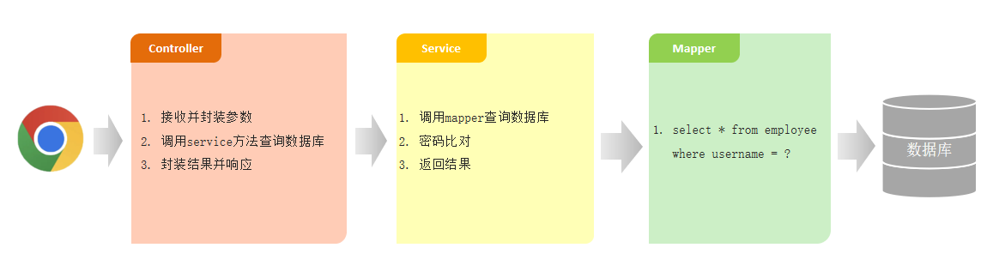

**1.Controller层**

在sky-server模块中，com.sky.controller.admin.EmployeeController

```java
/**
     * 登录
     *
     * @param employeeLoginDTO
     * @return
     */
    @PostMapping("/login")
    public Result<EmployeeLoginVO> login(@RequestBody EmployeeLoginDTO employeeLoginDTO) {
        log.info("员工登录：{}", employeeLoginDTO);
		//调用service方法查询数据库
        Employee employee = employeeService.login(employeeLoginDTO);

        //登录成功后，生成jwt令牌
        Map<String, Object> claims = new HashMap<>();
        claims.put(JwtClaimsConstant.EMP_ID, employee.getId());
        String token = JwtUtil.createJWT(
                jwtProperties.getAdminSecretKey(),
                jwtProperties.getAdminTtl(),
                claims);

        EmployeeLoginVO employeeLoginVO = EmployeeLoginVO.builder()
                .id(employee.getId())
                .userName(employee.getUsername())
                .name(employee.getName())
                .token(token)
                .build();

        return Result.success(employeeLoginVO);
    }
```

**2.Service层**

在sky-server模块中，com.sky.service.impl.EmployeeServiceImpl

```java
/**
     * 员工登录
     *
     * @param employeeLoginDTO
     * @return
     */
    public Employee login(EmployeeLoginDTO employeeLoginDTO) {
        String username = employeeLoginDTO.getUsername();
        String password = employeeLoginDTO.getPassword();

        //1、根据用户名查询数据库中的数据
        Employee employee = employeeMapper.getByUsername(username);

        //2、处理各种异常情况（用户名不存在、密码不对、账号被锁定）
        if (employee == null) {
            //账号不存在
            throw new AccountNotFoundException(MessageConstant.ACCOUNT_NOT_FOUND);
        }

        //密码比对
        if (!password.equals(employee.getPassword())) {
            //密码错误
            throw new PasswordErrorException(MessageConstant.PASSWORD_ERROR);
        }

        if (employee.getStatus() == StatusConstant.DISABLE) {
            //账号被锁定
            throw new AccountLockedException(MessageConstant.ACCOUNT_LOCKED);
        }

        //3、返回实体对象
        return employee;
    }
```

**3.Mapper层**

在sky-server模块中，com.sky.mapper.EmployeeMapper

```java
package com.sky.mapper;

import com.sky.entity.Employee;
import org.apache.ibatis.annotations.Mapper;
import org.apache.ibatis.annotations.Select;

@Mapper
public interface EmployeeMapper {

    /**
     * 根据用户名查询员工
     * @param username
     * @return
     */
    @Select("select * from employee where username = #{username}")
    Employee getByUsername(String username);

}

```

注：可以通过断点调试跟踪后端程序的执行过程


#### 3.2.5 nginx反向代理和负载均衡

对登录功能测试完毕后，接下来，我们思考一个问题：**前端发送的请求，是如何请求到后端服务的？**

前端请求地址：http://localhost/api/employee/login

后端接口地址：http://localhost:8080/admin/employee/login


​              **前端请求地址**                                                                                       **后端接口地址**

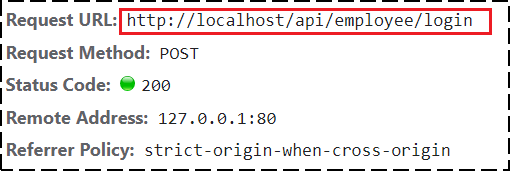                                  

很明显，两个地址不一致，那是如何请求到后端服务的呢？

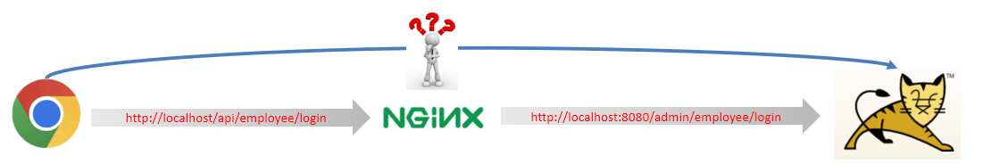


**1). nginx反向代理**

**nginx 反向代理**，就是将前端发送的动态请求由 nginx 转发到后端服务器

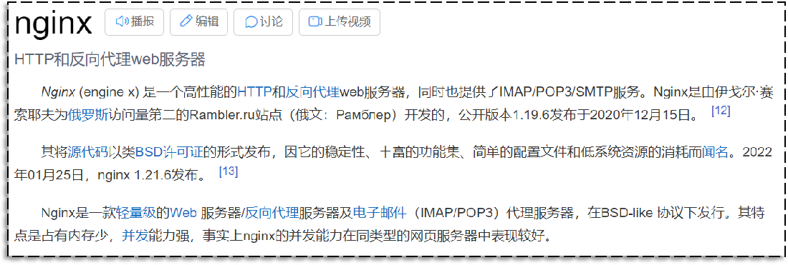

那为什么不直接通过浏览器直接请求后台服务端，需要通过nginx反向代理呢？


**nginx 反向代理的好处：**

- 提高访问速度

  因为nginx本身可以进行缓存，如果访问的同一接口，并且做了数据缓存，nginx就直接可把数据返回，不需要真正地访问服务端，从而提高访问速度。

- 进行负载均衡

  所谓负载均衡,就是把大量的请求按照我们指定的方式均衡的分配给集群中的每台服务器。

- 保证后端服务安全

  因为一般后台服务地址不会暴露，所以使用浏览器不能直接访问，可以把nginx作为请求访问的入口，请求到达nginx后转发到具体的服务中，从而保证后端服务的安全。

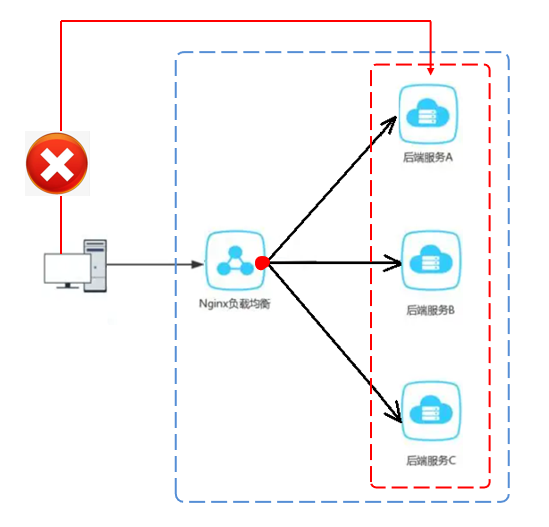

**nginx 反向代理的配置方式：**

```nginx
server{
    listen 80;
    server_name localhost;
    
    location /api/{
        proxy_pass http://localhost:8080/admin/; #反向代理
    }
}
```

**proxy_pass：**该指令是用来设置代理服务器的地址，可以是主机名称，IP地址加端口号等形式。

如上代码的含义是：监听80端口号， 然后当我们访问 http://localhost:80/api/../..这样的接口的时候，它会通过 location /api/ {} 这样的反向代理到 http://localhost:8080/admin/上来。


接下来，进到nginx-1.20.2\conf，打开nginx配置

```nginx
# 反向代理,处理管理端发送的请求
location /api/ {
	proxy_pass   http://localhost:8080/admin/;
    #proxy_pass   http://webservers/admin/;
}
```

当在访问http://localhost/api/employee/login，nginx接收到请求后转到http://localhost:8080/admin/，故最终的请求地址为http://localhost:8080/admin/employee/login，和后台服务的访问地址一致。


**2). nginx 负载均衡**

当如果服务以集群的方式进行部署时，那nginx在转发请求到服务器时就需要做相应的负载均衡。其实，负载均衡从本质上来说也是基于反向代理来实现的，最终都是转发请求。


**nginx 负载均衡的配置方式：**

```nginx
upstream webservers{
    server 192.168.100.128:8080;
    server 192.168.100.129:8080;
}
server{
    listen 80;
    server_name localhost;
    
    location /api/{
        proxy_pass http://webservers/admin;#负载均衡
    }
}
```

**upstream：**如果代理服务器是一组服务器的话，我们可以使用upstream指令配置后端服务器组。

如上代码的含义是：监听80端口号， 然后当我们访问 http://localhost:80/api/../..这样的接口的时候，它会通过 location /api/ {} 这样的反向代理到 http://webservers/admin，根据webservers名称找到一组服务器，根据设置的负载均衡策略(默认是轮询)转发到具体的服务器。

**注：**upstream后面的名称可自定义，但要上下保持一致。


**nginx 负载均衡策略：**

| **名称**   | **说明**                                               |
| ---------- | ------------------------------------------------------ |
| 轮询       | 默认方式                                               |
| weight     | 权重方式，默认为1，权重越高，被分配的客户端请求就越多  |
| ip_hash    | 依据ip分配方式，这样每个访客可以固定访问一个后端服务   |
| least_conn | 依据最少连接方式，把请求优先分配给连接数少的后端服务   |
| url_hash   | 依据url分配方式，这样相同的url会被分配到同一个后端服务 |
| fair       | 依据响应时间方式，响应时间短的服务将会被优先分配       |

具体配置方式：

**轮询：**

```nginx
upstream webservers{
    server 192.168.100.128:8080;
    server 192.168.100.129:8080;
}
```

**weight:**

```nginx
upstream webservers{
    server 192.168.100.128:8080 weight=90;
    server 192.168.100.129:8080 weight=10;
}
```

**ip_hash:**

```nginx
upstream webservers{
    ip_hash;
    server 192.168.100.128:8080;
    server 192.168.100.129:8080;
}
```

**least_conn:**

```nginx
upstream webservers{
    least_conn;
    server 192.168.100.128:8080;
    server 192.168.100.129:8080;
}
```

**url_hash:**

```nginx
upstream webservers{
    hash &request_uri;
    server 192.168.100.128:8080;
    server 192.168.100.129:8080;
}
```

**fair:**

```nginx
upstream webservers{
    server 192.168.100.128:8080;
    server 192.168.100.129:8080;
    fair;
}
```


